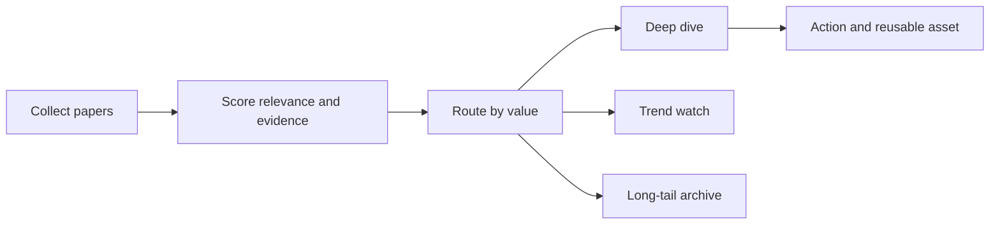

# Frontier Theory Radar

<h3 align="center">Evidence-first decisions on which frontier AI papers matter now, later, or not yet.</h3>

<p align="center">
  A daily research system that separates immediate engineering value, emerging trends, durable long-tail ideas, and noise.
</p>

<p align="center">
  <a href="README.zh-CN.md">简体中文</a> ·
  <a href="https://radar.aiutil.com">Live radar</a> ·
  <a href="https://radar.aiutil.com/daily.html">Daily reports</a> ·
  <a href="https://radar.aiutil.com/about.html">Methodology</a>
</p>

<p align="center">
  <a href="https://github.com/aiutil/frontier-theory-radar/actions/workflows/ci.yml"></a>
  <a href="LICENSE"></a>
  
</p>


## Latest research run · 2026-09-23

| Papers reviewed | Immediate | Trend | Long tail | Deferred |
| ---: | ---: | ---: | ---: | ---: |
| 10 | 110 | 191 | 180 | 1319 |

**Deep dive:** [Harness-Zero: Harness Distillation via Agent-as-Harness](daily/2026/2026-09-23.md) · Immediate · 重点学习


## Recent reports

| Date | Deep dive | Value | Decision |
| --- | --- | --- | --- |
| [2026-09-23](daily/2026/2026-09-23.md) | Harness-Zero: Harness Distillation via Agent-as-Harness | Immediate | 重点学习 |
| [2026-09-21](daily/2026/2026-09-21.md) | Quantifying Overclaiming Propensity in Frontier LLM Agents | Immediate | 重点学习 |
| [2026-09-20](daily/2026/2026-09-20.md) | Quantifying Overclaiming Propensity in Frontier LLM Agents | Immediate | 重点学习 |
| [2026-09-19](daily/2026/2026-09-19.md) | Quantifying Overclaiming Propensity in Frontier LLM Agents | Immediate | 重点学习 |
| [2026-09-18](daily/2026/2026-09-18.md) | Cognitive Extensions for Dual-Process Language Agents: Memory and Self-Reflection in Interactive Environments | Trend | 重点学习 |
| [2026-09-17](daily/2026/2026-09-17.md) | ZGCM-1: A Fully Open and Extremely Efficient Foundation Model for Math and Agentic Search | Trend | 重点学习 |
| [2026-09-16](daily/2026/2026-09-16.md) | Corrupt Plans, Clean Traces: Evading Chain-of-Thought Monitoring with Plan Injection | Trend | 重点学习 |

## Directions under active observation

| Direction | Stage | Related papers |
| --- | --- | ---: |
| [Agentic World Modeling](https://radar.aiutil.com/trend-detail.html?id=agentic-world-modeling) | 上升 | 573 |
| [Coding Agent](https://radar.aiutil.com/trend-detail.html?id=coding-agent) | 主流化 | 510 |
| [Context Engineering](https://radar.aiutil.com/trend-detail.html?id=context-engineering) | 上升 | 573 |

## Why this repository exists

Paper feeds optimize for recency and popularity. Frontier Theory Radar optimizes for decisions: what deserves an experiment today, what needs repeated observation, what should be preserved for later, and what does not yet justify attention. Each conclusion keeps its source link and states the largest remaining uncertainty.

## Research workflow



- `papers/` stores dated source snapshots and scored candidates.
- `daily/` stores the human-readable decision record for each run.
- `trends/` and `insights/` retain multi-day directions and reusable findings.
- `docs/data/` is the structured public projection used by the live site.
- `scripts/generate_readme.py` rebuilds both READMEs and the activity chart from committed evidence.

## Evidence boundaries

Scores and decisions are research judgments, not claims of independent reproduction. A paper abstract, author-reported benchmark, open-source implementation, and independently reproduced result are treated as different evidence levels. Missing code, truncated abstracts, or unverified benchmarks are called out rather than silently upgraded into facts.

## Run and verify

```bash
./run_daily.sh 2026-08-07
python3 -m pytest tests
python3 scripts/generate_readme.py
```

The scheduled production job runs in the private AIUtil automation environment. Credentials and private runtime memory are not stored here. The generated Markdown, SVG, JSON, and source-linked reports remain reviewable in Git history.

## Security

Do not commit feed credentials, API tokens, private paper collections, or operator memory. Report a vulnerability privately through [GitHub Security Advisories](https://github.com/aiutil/frontier-theory-radar/security/advisories/new).

## License

Apache License 2.0. See [NOTICE](NOTICE).
