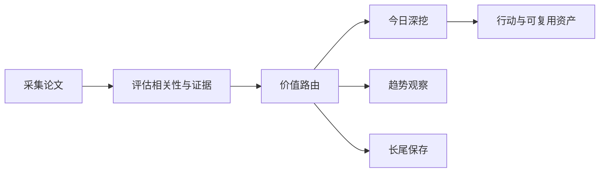

# 前沿理论驱动技术雷达

<h3 align="center">用可追溯证据判断：哪些前沿 AI 论文现在值得行动、哪些值得观察、哪些应当暂缓。</h3>

<p align="center">
  每日完成论文采集、价值路由、深度判断与趋势沉淀，区分即时价值、趋势价值、长尾价值与噪声。
</p>

<p align="center">
  <a href="README.md">English</a> ·
  <a href="https://radar.aiutil.com">在线雷达</a> ·
  <a href="https://radar.aiutil.com/daily.html">日报</a> ·
  <a href="https://radar.aiutil.com/about.html">研究方法</a>
</p>

<p align="center">
  <a href="https://github.com/aiutil/frontier-theory-radar/actions/workflows/ci.yml"></a>
  <a href="LICENSE"></a>
  
</p>


## 最新研究 · 2026-09-26

| 审阅论文 | 即时价值 | 趋势价值 | 长尾价值 | 暂时忽略 |
| ---: | ---: | ---: | ---: | ---: |
| 10 | 113 | 197 | 191 | 1319 |

**今日深挖：** [DEEPO: Dual-Entropy Enhanced Policy Optimization for Hallucination in MLLMs](daily/2026/2026-09-26.md) · 即时价值 · 重点学习

**核心判断：** 据摘要（arXiv [2609.28570](https://arxiv.org/abs/2609.28570)），DEEPO 把 MLLM 幻觉归因到 RL correction chain 的两处明确弱点——(1) rollout 层：高 semantic-entropy 的 hard queries 频繁产生 unanimously-wrong sample groups，让 group-relative advantage 在'幻觉风险最高处'坍缩到 0；(2) optimization 层：confidence 信号被滥用。这是 ai-agent × multimodal-agent × llm-evaluation 的'失败机制命名 + 可移植修复'工程资产：与今日 [28075](https://arxiv.org/abs/2609.28475) 'Behavioral Stress Tests for Reliability Routing'、[28609](https://arxiv.org/abs/2609.28609) 'Adversarial Closed-Loop Curriculum'形成'今日 agent 可靠性三联证据'——分别覆盖 RL 内部熵治理、agent 行为级 reliability、训练分布动态化三个维度。⚠️ 重要观察：今日 arXiv API 仍返回 HTTP 406（连续第七日靠 RSS 后备），但 RSS 拉到的 URL 集合（[2609.28475](https://arxiv.org/abs/2609.28475)-[2609.28690](https://arxiv.org/abs/2609.28690)）与昨日（[2026-09-25](https://arxiv.org/abs/2609.25010-2609.25284)）完全不重叠，是新批次。

**建议动作：** 把 DEEPO（[2609.28570](https://arxiv.org/abs/2609.28570)）列为即时试点方向，写'RL correction chain 双熵治理'checklist 草稿；把 TWIST（[2609.28575](https://arxiv.org/abs/2609.28575)）'Intervention Quality Benchmark for Conversational Memory'同步列为即时试点，写'memory intervention quality'checklist 草稿；为 [28075](https://arxiv.org/abs/2609.28475) 'Behavioral Stress Tests for Reliability Routing'、[28609](https://arxiv.org/abs/2609.28609) 'AdvRole'、[28547](https://arxiv.org/abs/2609.28547) 'PAWS'、[28654](https://arxiv.org/abs/2609.28654) 'Object Permanence in World Models'维持趋势卡片；为 [28557](https://arxiv.org/abs/2609.28557) 'BaseCamp'、[28554](https://arxiv.org/abs/2609.28554) 'Pistis'、[28506](https://arxiv.org/abs/2609.28506) 'TW3Cast'、[28690](https://arxiv.org/abs/2609.28690) 'TRACER'维持长尾卡片；持续观察 arXiv API 是否恢复、RSS archive 滞后时长是否缩短。


## 最近 7 期日报

| 日期 | 深挖论文 | 价值类型 | 判断 |
| --- | --- | --- | --- |
| [2026-09-26](daily/2026/2026-09-26.md) | DEEPO: Dual-Entropy Enhanced Policy Optimization for Hallucination in MLLMs | 即时价值 | 重点学习 |
| [2026-09-25](daily/2026/2026-09-25.md) | Ovis-Embedding: Pushing the Frontiers of Universal Omni-Modal Embeddings | 即时价值 | 重点学习 |
| [2026-09-24](daily/2026/2026-09-24.md) | Ovis-Embedding: Pushing the Frontiers of Universal Omni-Modal Embeddings | 即时价值 | 重点学习 |
| [2026-09-23](daily/2026/2026-09-23.md) | Harness-Zero: Harness Distillation via Agent-as-Harness | 即时价值 | 重点学习 |
| [2026-09-21](daily/2026/2026-09-21.md) | Quantifying Overclaiming Propensity in Frontier LLM Agents | 即时价值 | 重点学习 |
| [2026-09-20](daily/2026/2026-09-20.md) | Quantifying Overclaiming Propensity in Frontier LLM Agents | 即时价值 | 重点学习 |
| [2026-09-19](daily/2026/2026-09-19.md) | Quantifying Overclaiming Propensity in Frontier LLM Agents | 即时价值 | 重点学习 |

## 当前重点趋势

| 方向 | 阶段 | 关联论文 |
| --- | --- | ---: |
| [Agentic World Modeling](https://radar.aiutil.com/trend-detail.html?id=agentic-world-modeling) | 上升 | 574 |
| [Coding Agent](https://radar.aiutil.com/trend-detail.html?id=coding-agent) | 主流化 | 524 |
| [Context Engineering](https://radar.aiutil.com/trend-detail.html?id=context-engineering) | 上升 | 574 |

## 为什么做这个项目

论文聚合站通常优化“新”和“热”，本项目优化“判断”：哪些值得今天试验，哪些需要连续观察，哪些虽然不热但应该保留，哪些证据不足应明确暂缓。每个结论都保留来源，并写清当前最大不确定性。

## 研究工作流



- `papers/`：按日期保存来源快照和评分候选。
- `daily/`：保存每次研究运行的人类可读判断记录。
- `trends/`、`insights/`：沉淀跨日趋势与可复用发现。
- `docs/data/`：在线站点使用的结构化公开投影。
- `scripts/generate_readme.py`：从已提交证据生成双语 README 和活动图表。

## 证据边界

评分与结论属于研究判断，不等于独立复现。论文摘要、作者自述 Benchmark、开源实现与第三方复现是不同证据等级。代码缺失、摘要截断或 Benchmark 未核验时，会明确标注，不把推断包装成事实。

## 本地运行与验证

```bash
./run_daily.sh 2026-08-07
python3 -m pytest tests
python3 scripts/generate_readme.py
```

生产定时任务运行在 AIUtil 私有自动化环境中，凭据和私有运行记忆不进入本仓库。生成后的 Markdown、SVG、JSON 和来源链接均可通过 Git 历史审阅。

## 安全

请勿提交数据源凭据、API Token、私有论文集合或运营记忆。安全问题请通过 [GitHub Security Advisories](https://github.com/aiutil/frontier-theory-radar/security/advisories/new) 私下报告。

## 开源协议

Apache License 2.0，详见 [NOTICE](NOTICE)。
