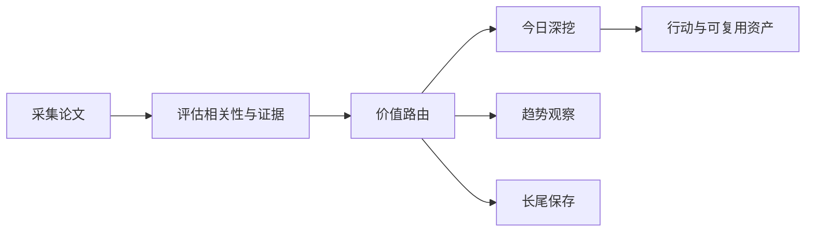

# 前沿理论驱动技术雷达

<h3 align="center">用可追溯证据判断：哪些前沿 AI 论文现在值得行动、哪些值得观察、哪些应当暂缓。</h3>

<p align="center">
  每日完成论文采集、价值路由、深度判断与趋势沉淀，区分即时价值、趋势价值、长尾价值与噪声。
</p>

<p align="center">
  <a href="README.md">English</a> ·
  <a href="https://radar.aiutil.com">在线雷达</a> ·
  <a href="https://radar.aiutil.com/daily.html">日报</a> ·
  <a href="https://radar.aiutil.com/about.html">研究方法</a>
</p>

<p align="center">
  <a href="https://github.com/aiutil/frontier-theory-radar/actions/workflows/ci.yml"></a>
  <a href="LICENSE"></a>
  
</p>


## 最新研究 · 2026-08-27

| 审阅论文 | 即时价值 | 趋势价值 | 长尾价值 | 暂时忽略 |
| ---: | ---: | ---: | ---: | ---: |
| 10 | 97 | 135 | 120 | 1278 |

**今日深挖：** [Recursive Experiential-Working Memory Evolution for Long-Horizon Agent Harnesses](daily/2026/2026-08-27.md) · 即时价值 · 轻量试点

**核心判断：** Recuris 把 long-horizon agent 的 memory 拆成 Working Memory（管任务进度）+ Experiential Memory（管跨轨迹技能库），并把执行变成结构化失败证据——与昨日 Prime Agent 的 REPL + Continual Harness 同方向（跨会话可积累能力），但聚焦 memory 结构分离；Prompt Structure 用 424 个安全敏感 Python 任务 × GPT-4o/LLaMA 3.1-8B × 5 种 prompt 变体系统证伪'prompt 结构 = 更安全'的直觉——把'prompt 工程万能'变成可定量评估的盲区；FID Hides 用具体反例（ImageNet 上视觉不可识别但仅匹配参考 Inception mean/cov 的图像获 FID 24.7 vs 真实图像 FID 58.6）证明 FID 标量本身不是 calibrated test。三个趋势信号也值得关注：SPO++ 修复异步 agentic RL 的 trajectory-vs-token-weighted 中心化偏差；BrowserForge 用并行浏览器沙箱规模化生成 web agent 训练数据；LAION-BVD 把视频多模态预训练数据推到 10M 小时量级。

**建议动作：** 完成三件事：(1) 跟踪 Recuris 开源——评估其 Working/Experiential Memory 抽象是否可与团队 long-horizon agent harness 兼容，可在内部 agent 上做 memory 抽象对比（不依赖完整开源，memory 分层思想可借鉴，1 周内可做概念验证）；(2) 把'prompt 变体鲁棒性'纳入团队 coding-agent 评测设计——基于 Prompt Structure 的'424 任务 × 多 prompt 变体'实证原则，可立刻在团队内部安全敏感代码生成任务上加'prompt 变体对照'维度（30 分钟可设计、1-2 天可实施）；(3) 把'FID 偏差检测'纳入团队生成模型选型流程——不再把 FID 数值当作唯一排序依据，加入 FID Hides 的偏差检测思路（30 分钟可制定规则、1 周内可在选型中应用）。


## 最近 7 期日报

| 日期 | 深挖论文 | 价值类型 | 判断 |
| --- | --- | --- | --- |
| [2026-08-27](daily/2026/2026-08-27.md) | Recursive Experiential-Working Memory Evolution for Long-Horizon Agent Harnesses | 即时价值 | 轻量试点 |
| [2026-08-26](daily/2026/2026-08-26.md) | Prime Agent: A Self-Improving RLM Harness | 即时价值 | 轻量试点 |
| [2026-08-25](daily/2026/2026-08-25.md) | Natural-Language Workflows Are Not Software Yet: Artifact-Driven Compilation for Reliable Agent Execution | 即时价值 | 轻量试点 |
| [2026-08-24](daily/2026/2026-08-24.md) | AI4AI-Bench: Benchmarking LLM Agents in Algorithmic Design for Recursive Self-Improvement | 即时价值 | 轻量试点 |
| [2026-08-23](daily/2026/2026-08-23.md) | AI4AI-Bench: Benchmarking LLM Agents in Algorithmic Design for Recursive Self-Improvement | 即时价值 | 轻量试点 |
| [2026-08-21](daily/2026/2026-08-21.md) | AI4AI-Bench: Benchmarking LLM Agents in Algorithmic Design for Recursive Self-Improvement | 即时价值 | 轻量试点 |
| [2026-08-20](daily/2026/2026-08-20.md) | Projecting BrowseComp-Plus onto ClimbMix: Toward More Realistic Corpora for Agentic Search | 暂时忽略 | 暂时忽略 |

## 当前重点趋势

| 方向 | 阶段 | 关联论文 |
| --- | --- | ---: |
| [Agentic World Modeling](https://radar.aiutil.com/trend-detail.html?id=agentic-world-modeling) | 上升 | 536 |
| [Coding Agent](https://radar.aiutil.com/trend-detail.html?id=coding-agent) | 主流化 | 437 |
| [Context Engineering](https://radar.aiutil.com/trend-detail.html?id=context-engineering) | 上升 | 536 |

## 为什么做这个项目

论文聚合站通常优化“新”和“热”，本项目优化“判断”：哪些值得今天试验，哪些需要连续观察，哪些虽然不热但应该保留，哪些证据不足应明确暂缓。每个结论都保留来源，并写清当前最大不确定性。

## 研究工作流



- `papers/`：按日期保存来源快照和评分候选。
- `daily/`：保存每次研究运行的人类可读判断记录。
- `trends/`、`insights/`：沉淀跨日趋势与可复用发现。
- `docs/data/`：在线站点使用的结构化公开投影。
- `scripts/generate_readme.py`：从已提交证据生成双语 README 和活动图表。

## 证据边界

评分与结论属于研究判断，不等于独立复现。论文摘要、作者自述 Benchmark、开源实现与第三方复现是不同证据等级。代码缺失、摘要截断或 Benchmark 未核验时，会明确标注，不把推断包装成事实。

## 本地运行与验证

```bash
./run_daily.sh 2026-08-07
python3 -m pytest tests
python3 scripts/generate_readme.py
```

生产定时任务运行在 AIUtil 私有自动化环境中，凭据和私有运行记忆不进入本仓库。生成后的 Markdown、SVG、JSON 和来源链接均可通过 Git 历史审阅。

## 安全

请勿提交数据源凭据、API Token、私有论文集合或运营记忆。安全问题请通过 [GitHub Security Advisories](https://github.com/aiutil/frontier-theory-radar/security/advisories/new) 私下报告。

## 开源协议

Apache License 2.0，详见 [NOTICE](NOTICE)。
