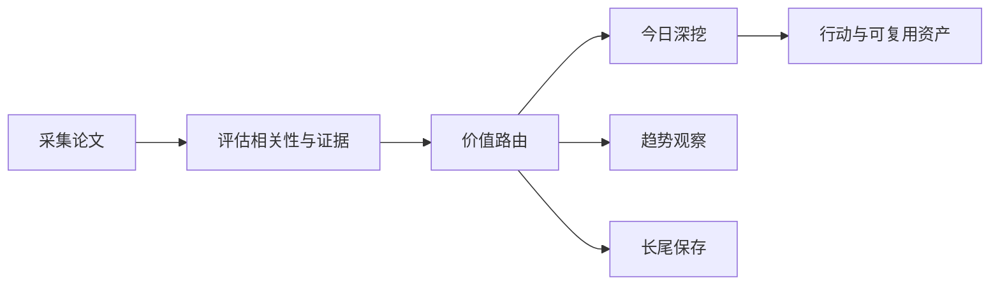

# 前沿理论驱动技术雷达

<h3 align="center">用可追溯证据判断：哪些前沿 AI 论文现在值得行动、哪些值得观察、哪些应当暂缓。</h3>

<p align="center">
  每日完成论文采集、价值路由、深度判断与趋势沉淀，区分即时价值、趋势价值、长尾价值与噪声。
</p>

<p align="center">
  <a href="README.md">English</a> ·
  <a href="https://radar.aiutil.com">在线雷达</a> ·
  <a href="https://radar.aiutil.com/daily.html">日报</a> ·
  <a href="https://radar.aiutil.com/about.html">研究方法</a>
</p>

<p align="center">
  <a href="https://github.com/aiutil/frontier-theory-radar/actions/workflows/ci.yml"></a>
  <a href="LICENSE"></a>
  
</p>


## 最新研究 · 2026-09-06

| 审阅论文 | 即时价值 | 趋势价值 | 长尾价值 | 暂时忽略 |
| ---: | ---: | ---: | ---: | ---: |
| 10 | 110 | 152 | 138 | 1300 |

**今日深挖：** [Clean Engineering, Unstable Measurement: A Preregistered Reliability Failure of Black-Box LLM Observers on Shared Endpoints](daily/2026/2026-09-06.md) · 即时价值 · 重点学习

**核心判断：** 据摘要，Clean Engineering, Unstable Measurement（[2609.04198](http://arxiv.org/abs/2609.04198v1)）用两个预注册活动审计 LLM-as-a-Judge 作为 measurement instrument 的核心假设——52,988 audited request attempts 中 same-window repeat rankings 仅达 Spearman 0.400（必达阈值之上），挑战 leaderboard / 训练 reward 信号的稳态假设；与 Beyond Scores（[2609.01604]）的 judge 机制扰动分析、Legibility is Not Interpretability（[2609.04194]）的 judge legibility 假设共同形成'judge 三件套'趋势簇——judge 机制可读性 / judge 测量可靠性 / judge legibility = interpretability。Knowledge Acquisition During Pre-training?（[2609.04180](http://arxiv.org/abs/2609.04180v1)）用 controlled experiments 隔离 repetition 与 auxiliary views 的因果效果，确认 repetition 是 acquisition 必要条件、paraphrasing 只在较小 batch size 有帮助，并在 token budget 固定条件下证明把 tokens 从 repetition 分配到 auxiliary views 改善 learning；直接回答'pre-training 数据 budget 应如何分配'。Compile by Training（[2609.04199](http://arxiv.org/abs/2609.04199v1)）把重复文本函数从'每次调远程 LLM'推到'compile by training → 本地 adapter + compact interpreter'——把 NL 规范变成可复用的本地神经函数，避免 vendor lock-in 与每请求成本，与 Quantization Damage（[2609.01587]）的精度预算、Knowledge Acquisition（[2609.04180]）的数据 budget 形成'预算三角'。趋势层：ESPO（[2609.04197](http://arxiv.org/abs/2609.04197v1)）把 evolutionary prompt optimization 从'append 规则 + 3× 长度不增精度'推到'Error-Structured Prompt Optimization (Diagnose → Diversify → Stabilize)'；Legibility is Not Interpretability（[2609.04194]）把 CoT reasoning 的'legibility = interpretability'假设从'默认成立'推到'judged importance vs actual importance 系统性对比'；Last Translation Benchmark（[2609.04173](http://arxiv.org/abs/2609.04173v1)）把机器翻译评测从'饱和 benchmark + 不可靠自动指标'推到'last benchmark——同时解决饱和、不可靠自动指标、人工评测不可扩展'。Seeing Before Synthesizing（[2609.04183](http://arxiv.org/abs/2609.04183v1)）把 dense video captioning 从'LLM 合成的无 grounding transition caption'推到'SBS: VLM-Guided Transition Event Discovery'。

**建议动作：** 2026-09-06 回看 | 完成五件事：(1) 跟踪 Clean Engineering Unstable Measurement 的完整预注册报告与可能的修复方案——评估其'same-window repeat rankings Spearman 0.400 vs 必达阈值'对团队现有 LLM-as-a-Judge / leaderboard / 训练 reward 信号的可借鉴性（30 分钟可对团队近 30 天的 judge 调用做重复性测试）；(2) 跟踪 Knowledge Acquisition During Pre-training 的完整 controlled 实验数据与开源——评估其'auxiliary views 在 token budget 固定条件下改善 learning'对团队 pre-training 数据工程的边界（1-2 周可在小子集做 repetition vs paraphrase vs translation 三组对比）；(3) 跟踪 Compile by Training 的开源与定量对比——评估其'compact interpreter + adapter'对团队重复文本函数从远程 LLM 切换到本地神经函数的可行性（30 分钟可识别候选函数、1 周内可做 PoC）；(4) 把 ESPO / Legibility is Not Interpretability / Last Translation Benchmark / Seeing Before Synthesizing 纳入趋势观察线（与 judge 三件套趋势簇共振），跟踪开源与定量结果；(5) 为 EditVid / Robust PAC Learning CSGs / Causal Probabilistic Explanation 三个长尾候选建立长尾观察卡片，并标注各自的开源/benchmark 跟踪信号。


## 最近 7 期日报

| 日期 | 深挖论文 | 价值类型 | 判断 |
| --- | --- | --- | --- |
| [2026-09-06](daily/2026/2026-09-06.md) | Clean Engineering, Unstable Measurement: A Preregistered Reliability Failure of Black-Box LLM Observers on Shared Endpoints | 即时价值 | 重点学习 |
| [2026-09-04](daily/2026/2026-09-04.md) | Post-Training Language Models for Gold-Medal Performance in Coding Competitions | 即时价值 | 重点学习 |
| [2026-09-03](daily/2026/2026-09-03.md) | The Structure of Quantization Damage in LLMs: Why the Next Bit Should Be Spent Globally | 即时价值 | 轻量试点 |
| [2026-09-02](daily/2026/2026-09-02.md) | Configurable Semantic Chunking for Biomedical Information Extraction in Retrieval-Augmented Generation | 暂时忽略 | 暂时忽略 |
| [2026-09-01](daily/2026/2026-09-01.md) | PULSAR: Pooled Unified Late-Interaction Search and Retrieval for Enterprise Visual Document RAG | 即时价值 | 轻量试点 |
| [2026-08-30](daily/2026/2026-08-30.md) | WikiSkill: Compiling Agent Experience into Persistent Knowledge for Skill Evolution | 即时价值 | 轻量试点 |
| [2026-08-29](daily/2026/2026-08-29.md) | WikiSkill: Compiling Agent Experience into Persistent Knowledge for Skill Evolution | 即时价值 | 轻量试点 |

## 当前重点趋势

| 方向 | 阶段 | 关联论文 |
| --- | --- | ---: |
| [Agentic World Modeling](https://radar.aiutil.com/trend-detail.html?id=agentic-world-modeling) | 上升 | 552 |
| [Coding Agent](https://radar.aiutil.com/trend-detail.html?id=coding-agent) | 主流化 | 463 |
| [Context Engineering](https://radar.aiutil.com/trend-detail.html?id=context-engineering) | 上升 | 552 |

## 为什么做这个项目

论文聚合站通常优化“新”和“热”，本项目优化“判断”：哪些值得今天试验，哪些需要连续观察，哪些虽然不热但应该保留，哪些证据不足应明确暂缓。每个结论都保留来源，并写清当前最大不确定性。

## 研究工作流



- `papers/`：按日期保存来源快照和评分候选。
- `daily/`：保存每次研究运行的人类可读判断记录。
- `trends/`、`insights/`：沉淀跨日趋势与可复用发现。
- `docs/data/`：在线站点使用的结构化公开投影。
- `scripts/generate_readme.py`：从已提交证据生成双语 README 和活动图表。

## 证据边界

评分与结论属于研究判断，不等于独立复现。论文摘要、作者自述 Benchmark、开源实现与第三方复现是不同证据等级。代码缺失、摘要截断或 Benchmark 未核验时，会明确标注，不把推断包装成事实。

## 本地运行与验证

```bash
./run_daily.sh 2026-08-07
python3 -m pytest tests
python3 scripts/generate_readme.py
```

生产定时任务运行在 AIUtil 私有自动化环境中，凭据和私有运行记忆不进入本仓库。生成后的 Markdown、SVG、JSON 和来源链接均可通过 Git 历史审阅。

## 安全

请勿提交数据源凭据、API Token、私有论文集合或运营记忆。安全问题请通过 [GitHub Security Advisories](https://github.com/aiutil/frontier-theory-radar/security/advisories/new) 私下报告。

## 开源协议

Apache License 2.0，详见 [NOTICE](NOTICE)。
