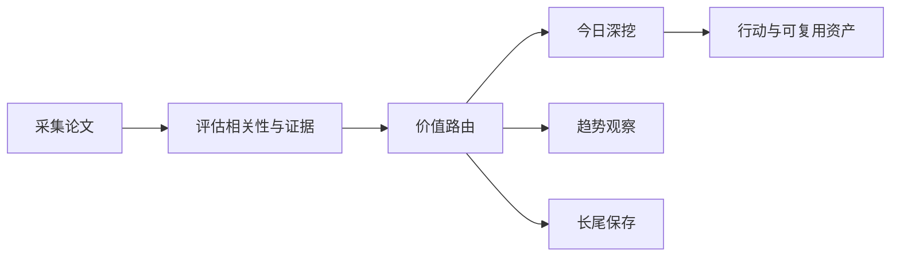

# 前沿理论驱动技术雷达

<h3 align="center">用可追溯证据判断：哪些前沿 AI 论文现在值得行动、哪些值得观察、哪些应当暂缓。</h3>

<p align="center">
  每日完成论文采集、价值路由、深度判断与趋势沉淀，区分即时价值、趋势价值、长尾价值与噪声。
</p>

<p align="center">
  <a href="README.md">English</a> ·
  <a href="https://radar.aiutil.com">在线雷达</a> ·
  <a href="https://radar.aiutil.com/daily.html">日报</a> ·
  <a href="https://radar.aiutil.com/about.html">研究方法</a>
</p>

<p align="center">
  <a href="https://github.com/aiutil/frontier-theory-radar/actions/workflows/ci.yml"></a>
  <a href="LICENSE"></a>
  
</p>


## 最新研究 · 2026-09-01

| 审阅论文 | 即时价值 | 趋势价值 | 长尾价值 | 暂时忽略 |
| ---: | ---: | ---: | ---: | ---: |
| 10 | 102 | 140 | 128 | 1290 |

**今日深挖：** [PULSAR: Pooled Unified Late-Interaction Search and Retrieval for Enterprise Visual Document RAG](daily/2026/2026-09-01.md) · 即时价值 · 轻量试点

**核心判断：** PULSAR 是部署在 Mubadala Investment Company 的 production vision-first retrieval system，用冻结 ColPali-style backbone 直接索引 page images + pooled two-stage late-interaction index（page summaries 初检 + page-level scoring 精排），把视觉文档检索从'OCR + 图说'改为'视觉直接索引 + 两阶段 late-interaction'——在小时级节奏的企业文档检索上免掉 OCR 刷新成本。Logos 把 agent harness 从'单进程共享一个 context'改为'cross-process bus'——所有 component 共处一个物理故障域的问题被解耦，让故障悬挂与进程死亡不再传播到全组件，直击单进程 plugin 的核心故障传播问题，并为 agent 治理提供更可审计的故障边界。一个趋势信号：[Quest: Survey of Optimizers](http://arxiv.org/abs/2608.28557v1) 把 NN 优化从'Adam 变体盘点'重构为四轴设计空间（temporal estimation / update geometry / horizon-schedule / state representation），强调分片+低精度生存能力，为评估/选型/自研优化器提供比'新旧 Adam 变体'更结构化的视角；[Aero Hand Open](http://arxiv.org/abs/2608.28578v1) 把 tendon-driven 灵巧手作为可直接学习的仿真资产开放，示范了'硬件经济性 + 仿真可学性'的搭配。

**建议动作：** 2026-09-01 回看 | 完成四件事：(1) 跟踪 PULSAR 开源与定量结果，并在团队内部视觉文档检索 pipeline 上做最小验证（不依赖完整开源，冻结 backbone + 两阶段池化思路可作为对比基线，1 周内可设计验证实验）；(2) 把 Logos 的 cross-process bus 思路纳入 agent harness 韧性设计清单（30 分钟可梳理现有架构的故障边界、识别单进程 plugin 的故障域传播风险点，1 周内可在内部架构评审中应用）；(3) 把 Quest 综述的四轴（temporal estimation / update geometry / horizon-schedule / state representation）作为评估/选型/自研优化器的结构化视角，并在团队当前 optimizer 上做四轴定位；(4) 评估 Aero Hand Open 对团队具身/操作学习研究计划的潜在价值，建立仿真平台候选清单。


## 最近 7 期日报

| 日期 | 深挖论文 | 价值类型 | 判断 |
| --- | --- | --- | --- |
| [2026-09-01](daily/2026/2026-09-01.md) | PULSAR: Pooled Unified Late-Interaction Search and Retrieval for Enterprise Visual Document RAG | 即时价值 | 轻量试点 |
| [2026-08-30](daily/2026/2026-08-30.md) | WikiSkill: Compiling Agent Experience into Persistent Knowledge for Skill Evolution | 即时价值 | 轻量试点 |
| [2026-08-29](daily/2026/2026-08-29.md) | WikiSkill: Compiling Agent Experience into Persistent Knowledge for Skill Evolution | 即时价值 | 轻量试点 |
| [2026-08-28](daily/2026/2026-08-28.md) | PlanSightRAG: A Visual-First Multimodal RAG for Automating Question Answering and Compliance Checking for Civil Standard Plans | 暂时忽略 | 暂时忽略 |
| [2026-08-27](daily/2026/2026-08-27.md) | Recursive Experiential-Working Memory Evolution for Long-Horizon Agent Harnesses | 即时价值 | 轻量试点 |
| [2026-08-26](daily/2026/2026-08-26.md) | Prime Agent: A Self-Improving RLM Harness | 即时价值 | 轻量试点 |
| [2026-08-25](daily/2026/2026-08-25.md) | Natural-Language Workflows Are Not Software Yet: Artifact-Driven Compilation for Reliable Agent Execution | 即时价值 | 轻量试点 |

## 当前重点趋势

| 方向 | 阶段 | 关联论文 |
| --- | --- | ---: |
| [Agentic World Modeling](https://radar.aiutil.com/trend-detail.html?id=agentic-world-modeling) | 上升 | 543 |
| [Coding Agent](https://radar.aiutil.com/trend-detail.html?id=coding-agent) | 主流化 | 447 |
| [Context Engineering](https://radar.aiutil.com/trend-detail.html?id=context-engineering) | 上升 | 543 |

## 为什么做这个项目

论文聚合站通常优化“新”和“热”，本项目优化“判断”：哪些值得今天试验，哪些需要连续观察，哪些虽然不热但应该保留，哪些证据不足应明确暂缓。每个结论都保留来源，并写清当前最大不确定性。

## 研究工作流



- `papers/`：按日期保存来源快照和评分候选。
- `daily/`：保存每次研究运行的人类可读判断记录。
- `trends/`、`insights/`：沉淀跨日趋势与可复用发现。
- `docs/data/`：在线站点使用的结构化公开投影。
- `scripts/generate_readme.py`：从已提交证据生成双语 README 和活动图表。

## 证据边界

评分与结论属于研究判断，不等于独立复现。论文摘要、作者自述 Benchmark、开源实现与第三方复现是不同证据等级。代码缺失、摘要截断或 Benchmark 未核验时，会明确标注，不把推断包装成事实。

## 本地运行与验证

```bash
./run_daily.sh 2026-08-07
python3 -m pytest tests
python3 scripts/generate_readme.py
```

生产定时任务运行在 AIUtil 私有自动化环境中，凭据和私有运行记忆不进入本仓库。生成后的 Markdown、SVG、JSON 和来源链接均可通过 Git 历史审阅。

## 安全

请勿提交数据源凭据、API Token、私有论文集合或运营记忆。安全问题请通过 [GitHub Security Advisories](https://github.com/aiutil/frontier-theory-radar/security/advisories/new) 私下报告。

## 开源协议

Apache License 2.0，详见 [NOTICE](NOTICE)。
