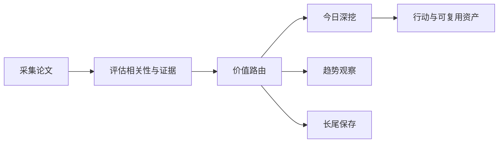

# 前沿理论驱动技术雷达

<h3 align="center">用可追溯证据判断：哪些前沿 AI 论文现在值得行动、哪些值得观察、哪些应当暂缓。</h3>

<p align="center">
  每日完成论文采集、价值路由、深度判断与趋势沉淀，区分即时价值、趋势价值、长尾价值与噪声。
</p>

<p align="center">
  <a href="README.md">English</a> ·
  <a href="https://radar.aiutil.com">在线雷达</a> ·
  <a href="https://radar.aiutil.com/daily.html">日报</a> ·
  <a href="https://radar.aiutil.com/about.html">研究方法</a>
</p>

<p align="center">
  <a href="https://github.com/aiutil/frontier-theory-radar/actions/workflows/ci.yml"></a>
  <a href="LICENSE"></a>
  
</p>


## 最新研究 · 2026-08-07

| 审阅论文 | 即时价值 | 趋势价值 | 长尾价值 | 暂时忽略 |
| ---: | ---: | ---: | ---: | ---: |
| 10 | 81 | 108 | 99 | 922 |

**今日深挖：** [Argus: A General-Purpose Agentic Runtime for Long-Horizon Reasoning](daily/2026/2026-08-07.md) · 即时价值 · 重点学习

**核心判断：** Argus 提出一个持久化、自演化的 agentic runtime——Manager/Planner/Engineer/Reviewer 四角色在持久项目状态上执行有界任务，核心设计是把稳定的用户意图与可变的操作目标、约束、验证标准分离。这是任何构建多步 agent 团队可直接参考的架构模式（证据支持时坚持、测量发现失败时转向）。Reasoning Core 则提供 50 个覆盖九大类的程序化推理数据生成器（含语义评分器、难度控制、任务评估器），可直接迁移到团队的推理训练数据合成流水线。

**建议动作：** 完成三件事：把 Argus 的四层分离架构模式（意图/操作目标/约束/验证标准 + 持久状态 + 角色分工 + 有界任务）纳入团队 agent 设计参考文档；评估 Reasoning Core 的 50 个程序化生成器能否补充团队推理训练数据合成流水线（若开源则挑 2-3 个试跑）；为 OctoLong、Skill Entropy 建立趋势观察卡片。


## 最近 7 期日报

| 日期 | 深挖论文 | 价值类型 | 判断 |
| --- | --- | --- | --- |
| [2026-08-07](daily/2026/2026-08-07.md) | Argus: A General-Purpose Agentic Runtime for Long-Horizon Reasoning | 即时价值 | 重点学习 |
| [2026-08-06](daily/2026/2026-08-06.md) | When Attention Goes Blind: Numerical Failure in ALiBi Positional Encodings | 即时价值 | 重点学习 |
| [2026-08-05](daily/2026/2026-08-05.md) | UEmbed: Unified Sparse and Dense Multimodal Embeddings | 即时价值 | 重点学习 |
| [2026-08-04](daily/2026/2026-08-04.md) | TokTier: Exact Stateful Tokenization for Agentic LLM Serving | 即时价值 | 重点学习 |
| [2026-08-03](daily/2026/2026-08-03.md) | Change2Task: From Repository Changes to Executable Coding Agent Tasks and Environments | 即时价值 | 重点学习 |
| [2026-08-02](daily/2026/2026-08-02.md) | Change2Task: From Repository Changes to Executable Coding Agent Tasks and Environments | 即时价值 | 重点学习 |
| [2026-08-01](daily/2026/2026-08-01.md) | Change2Task: From Repository Changes to Executable Coding Agent Tasks and Environments | 即时价值 | 重点学习 |

## 当前重点趋势

| 方向 | 阶段 | 关联论文 |
| --- | --- | ---: |
| [Agentic World Modeling](https://radar.aiutil.com/trend-detail.html?id=agentic-world-modeling) | 上升 | 413 |
| [Coding Agent](https://radar.aiutil.com/trend-detail.html?id=coding-agent) | 主流化 | 337 |
| [Context Engineering](https://radar.aiutil.com/trend-detail.html?id=context-engineering) | 上升 | 413 |

## 为什么做这个项目

论文聚合站通常优化“新”和“热”，本项目优化“判断”：哪些值得今天试验，哪些需要连续观察，哪些虽然不热但应该保留，哪些证据不足应明确暂缓。每个结论都保留来源，并写清当前最大不确定性。

## 研究工作流



- `papers/`：按日期保存来源快照和评分候选。
- `daily/`：保存每次研究运行的人类可读判断记录。
- `trends/`、`insights/`：沉淀跨日趋势与可复用发现。
- `docs/data/`：在线站点使用的结构化公开投影。
- `scripts/generate_readme.py`：从已提交证据生成双语 README 和活动图表。

## 证据边界

评分与结论属于研究判断，不等于独立复现。论文摘要、作者自述 Benchmark、开源实现与第三方复现是不同证据等级。代码缺失、摘要截断或 Benchmark 未核验时，会明确标注，不把推断包装成事实。

## 本地运行与验证

```bash
./run_daily.sh 2026-08-07
python3 -m pytest tests
python3 scripts/generate_readme.py
```

生产定时任务运行在 AIUtil 私有自动化环境中，凭据和私有运行记忆不进入本仓库。生成后的 Markdown、SVG、JSON 和来源链接均可通过 Git 历史审阅。

## 安全

请勿提交数据源凭据、API Token、私有论文集合或运营记忆。安全问题请通过 [GitHub Security Advisories](https://github.com/aiutil/frontier-theory-radar/security/advisories/new) 私下报告。

## 开源协议

Apache License 2.0，详见 [NOTICE](NOTICE)。
