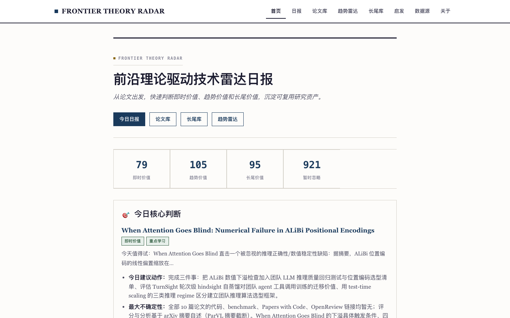
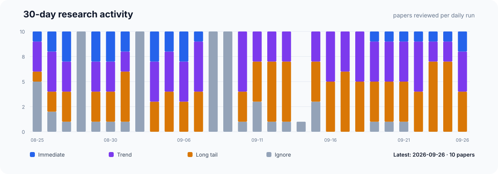
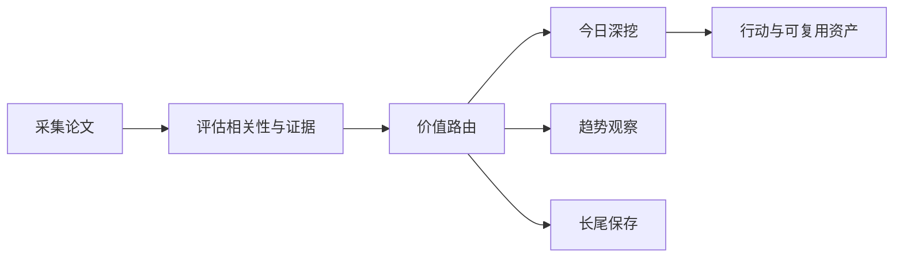

# 前沿理论驱动技术雷达

<h3 align="center">用可追溯证据判断：哪些前沿 AI 论文现在值得行动、哪些值得观察、哪些应当暂缓。</h3>

<p align="center">
  每日完成论文采集、价值路由、深度判断与趋势沉淀，区分即时价值、趋势价值、长尾价值与噪声。
</p>

<p align="center">
  <a href="README.md">English</a> ·
  <a href="https://radar.aiutil.com">在线雷达</a> ·
  <a href="https://radar.aiutil.com/daily.html">日报</a> ·
  <a href="https://radar.aiutil.com/about.html">研究方法</a>
</p>

<p align="center">
  <a href="https://github.com/aiutil/frontier-theory-radar/actions/workflows/ci.yml"></a>
  <a href="LICENSE"></a>
  
</p>



## 最新研究 · 2026-08-23

| 审阅论文 | 即时价值 | 趋势价值 | 长尾价值 | 暂时忽略 |
| ---: | ---: | ---: | ---: | ---: |
| 10 | 91 | 125 | 114 | 1270 |

**今日深挖：** [AI4AI-Bench: Benchmarking LLM Agents in Algorithmic Design for Recursive Self-Improvement](daily/2026/2026-08-23.md) · 即时价值 · 轻量试点

**核心判断：** AI4AI-Bench 把'agent 能否设计出更好的训练算法'这一递归自我改进的核心命题从整体能力里隔离出来，变成可单独评测的对象——这正是当前 agent 研究最缺的一环（过去 RSI 多停留在叙事，缺乏可量化的任务）。Inducing Task Models 揭示一个具体缺口：GUI/电脑使用 agent 已有大量被动 trace，但缺少能从中归纳出'可审计、可复用任务模型'的方法——对要把 agent 部署进真实工作流（而非一次性演示）的团队是关键信号。BrowseComp-Plus_CM 指出当前 agentic search 评测的语料同源偏差——证据与干扰项同 query 选出会高估 agent 的检索能力，把 ClimbMix 替换进去是更真实压力测试。三者都指向同一根源：评测与基础设施必须跟上 agent 从演示走向部署的现实。

**建议动作：** 完成三件事：评估 AI4AI-Bench 是否能成为团队'训练侧 agent 研究'的评测底座（关注任务是否覆盖实际训练算法修改的搜索空间，是否能与团队既有训练栈对接）；盘点内部 GUI/电脑使用 agent 的 trace 资产（评估 Inducing Task Models 思路的迁移可行性，trace 格式/规模/可审计任务模型的形式）；把 BrowseComp-Plus_CM 作为 agentic search 评测的更可信基线跟踪（即使 ClimbMix 不可直接复用，'避免同源干扰'原则可立刻应用到内部评测）。



## 最近 7 期日报

| 日期 | 深挖论文 | 价值类型 | 判断 |
| --- | --- | --- | --- |
| [2026-08-23](daily/2026/2026-08-23.md) | AI4AI-Bench: Benchmarking LLM Agents in Algorithmic Design for Recursive Self-Improvement | 即时价值 | 轻量试点 |
| [2026-08-21](daily/2026/2026-08-21.md) | AI4AI-Bench: Benchmarking LLM Agents in Algorithmic Design for Recursive Self-Improvement | 即时价值 | 轻量试点 |
| [2026-08-20](daily/2026/2026-08-20.md) | Projecting BrowseComp-Plus onto ClimbMix: Toward More Realistic Corpora for Agentic Search | 暂时忽略 | 暂时忽略 |
| [2026-08-19](daily/2026/2026-08-19.md) | Accelerated Genetic Programming Hyper-Heuristics for Simulation-Based Scheduling via Agentic AI | 长尾价值 | 持续观察 |
| [2026-08-18](daily/2026/2026-08-18.md) | ComponentBench: Diagnosing Component-Level Failures in Computer-Use Agents | 暂时忽略 | 暂时忽略 |
| [2026-08-17](daily/2026/2026-08-17.md) | KernelArc: A Multi-Agent Framework for GPU Kernel Optimization | 暂时忽略 | 暂时忽略 |
| [2026-08-16](daily/2026/2026-08-16.md) | PLSQLBench: Benchmarking LLM Systems for Executable Procedural Database Programming | 暂时忽略 | 暂时忽略 |

## 当前重点趋势

| 方向 | 阶段 | 关联论文 |
| --- | --- | ---: |
| [Agentic World Modeling](https://radar.aiutil.com/trend-detail.html?id=agentic-world-modeling) | 上升 | 532 |
| [Coding Agent](https://radar.aiutil.com/trend-detail.html?id=coding-agent) | 主流化 | 428 |
| [Context Engineering](https://radar.aiutil.com/trend-detail.html?id=context-engineering) | 上升 | 532 |

## 为什么做这个项目

论文聚合站通常优化“新”和“热”，本项目优化“判断”：哪些值得今天试验，哪些需要连续观察，哪些虽然不热但应该保留，哪些证据不足应明确暂缓。每个结论都保留来源，并写清当前最大不确定性。

## 研究工作流



- `papers/`：按日期保存来源快照和评分候选。
- `daily/`：保存每次研究运行的人类可读判断记录。
- `trends/`、`insights/`：沉淀跨日趋势与可复用发现。
- `docs/data/`：在线站点使用的结构化公开投影。
- `scripts/generate_readme.py`：从已提交证据生成双语 README 和活动图表。

## 证据边界

评分与结论属于研究判断，不等于独立复现。论文摘要、作者自述 Benchmark、开源实现与第三方复现是不同证据等级。代码缺失、摘要截断或 Benchmark 未核验时，会明确标注，不把推断包装成事实。

## 本地运行与验证

```bash
./run_daily.sh 2026-08-07
python3 -m pytest tests
python3 scripts/generate_readme.py
```

生产定时任务运行在 AIUtil 私有自动化环境中，凭据和私有运行记忆不进入本仓库。生成后的 Markdown、SVG、JSON 和来源链接均可通过 Git 历史审阅。

## 安全

请勿提交数据源凭据、API Token、私有论文集合或运营记忆。安全问题请通过 [GitHub Security Advisories](https://github.com/aiutil/frontier-theory-radar/security/advisories/new) 私下报告。

## 开源协议

Apache License 2.0，详见 [NOTICE](NOTICE)。
