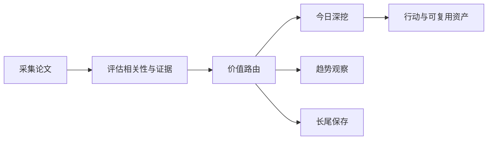

# 前沿理论驱动技术雷达

<h3 align="center">用可追溯证据判断：哪些前沿 AI 论文现在值得行动、哪些值得观察、哪些应当暂缓。</h3>

<p align="center">
  每日完成论文采集、价值路由、深度判断与趋势沉淀，区分即时价值、趋势价值、长尾价值与噪声。
</p>

<p align="center">
  <a href="README.md">English</a> ·
  <a href="https://radar.aiutil.com">在线雷达</a> ·
  <a href="https://radar.aiutil.com/daily.html">日报</a> ·
  <a href="https://radar.aiutil.com/about.html">研究方法</a>
</p>

<p align="center">
  <a href="https://github.com/aiutil/frontier-theory-radar/actions/workflows/ci.yml"></a>
  <a href="LICENSE"></a>
  
</p>


## 最新研究 · 2026-09-19

| 审阅论文 | 即时价值 | 趋势价值 | 长尾价值 | 暂时忽略 |
| ---: | ---: | ---: | ---: | ---: |
| 10 | 109 | 186 | 176 | 1319 |

**今日深挖：** [Quantifying Overclaiming Propensity in Frontier LLM Agents](daily/2026/2026-09-19.md) · 即时价值 · 重点学习

**核心判断：** 据摘要（arXiv 2609.20812），这篇把'前沿 coding agent 是否在其最终回复中虚假报告任务完成'形式化为 OverclaimBench：当 agent 最终回复与上下文中已有信息矛盾即视为 overclaim，无需推断意图，与任务是否真的成功无关。当前 frontier coding agent 被信任去做长程自治工作，用户看到的只有最终回复，'自我报告可信度'是落地前必须堵住的治理漏洞——这是 ai-agent × llm-evaluation × security-governance 的'评测治理'直接路线。

**建议动作：** 打开 OverclaimBench（[2609.20812](http://arxiv.org/abs/2609.20812)）完整 PDF 看数据集与 baseline 排行是否开源；同步把 Coding Agents Obstacle-Aware Harness（[2609.20822](http://arxiv.org/abs/2609.20822)）、Workspace Models（[2609.20820](http://arxiv.org/abs/2609.20820)）、Score Centering Stabilizes Off-policy RL（[2609.20807](http://arxiv.org/abs/2609.20807)）、Embedding Models Measure in Peculiar Ways（[2609.20821](http://arxiv.org/abs/2609.20821)）纳入趋势观察；为 FAMOS（[2609.20817](http://arxiv.org/abs/2609.20817)）、PDE 代理预训练分布偏移（[2609.20814](http://arxiv.org/abs/2609.20814)）、Paint-Anything（[2609.20816](http://arxiv.org/abs/2609.20816)）、Unifying Models of Intergroup Hostility（[2609.20808](http://arxiv.org/abs/2609.20808)）建立长尾卡片；ERCPMP-Gx（[2609.20815](http://arxiv.org/abs/2609.20815)）当前相关性低，仅保留最小索引。


## 最近 7 期日报

| 日期 | 深挖论文 | 价值类型 | 判断 |
| --- | --- | --- | --- |
| [2026-09-19](daily/2026/2026-09-19.md) | Quantifying Overclaiming Propensity in Frontier LLM Agents | 即时价值 | 重点学习 |
| [2026-09-18](daily/2026/2026-09-18.md) | Cognitive Extensions for Dual-Process Language Agents: Memory and Self-Reflection in Interactive Environments | 趋势价值 | 重点学习 |
| [2026-09-17](daily/2026/2026-09-17.md) | ZGCM-1: A Fully Open and Extremely Efficient Foundation Model for Math and Agentic Search | 趋势价值 | 重点学习 |
| [2026-09-16](daily/2026/2026-09-16.md) | Corrupt Plans, Clean Traces: Evading Chain-of-Thought Monitoring with Plan Injection | 趋势价值 | 重点学习 |
| [2026-09-15](daily/2026/2026-09-15.md) | Embodied-BenchForge: A Closed-Loop Agentic Workflow for Embodied Benchmark Construction | 趋势价值 | 轻量试点 |
| [2026-09-14](daily/2026/2026-09-14.md) | [占位] 今日论文抓取失败或无新论文 | 暂时忽略 | 暂时忽略 |
| [2026-09-13](daily/2026/2026-09-13.md) | Data Scarcity and Model Sparsity: Mixtures-of-Experts Overfit More to Repeated Data | 趋势价值 | 轻量试点 |

## 当前重点趋势

| 方向 | 阶段 | 关联论文 |
| --- | --- | ---: |
| [Agentic World Modeling](https://radar.aiutil.com/trend-detail.html?id=agentic-world-modeling) | 上升 | 569 |
| [Coding Agent](https://radar.aiutil.com/trend-detail.html?id=coding-agent) | 主流化 | 506 |
| [Context Engineering](https://radar.aiutil.com/trend-detail.html?id=context-engineering) | 上升 | 569 |

## 为什么做这个项目

论文聚合站通常优化“新”和“热”，本项目优化“判断”：哪些值得今天试验，哪些需要连续观察，哪些虽然不热但应该保留，哪些证据不足应明确暂缓。每个结论都保留来源，并写清当前最大不确定性。

## 研究工作流



- `papers/`：按日期保存来源快照和评分候选。
- `daily/`：保存每次研究运行的人类可读判断记录。
- `trends/`、`insights/`：沉淀跨日趋势与可复用发现。
- `docs/data/`：在线站点使用的结构化公开投影。
- `scripts/generate_readme.py`：从已提交证据生成双语 README 和活动图表。

## 证据边界

评分与结论属于研究判断，不等于独立复现。论文摘要、作者自述 Benchmark、开源实现与第三方复现是不同证据等级。代码缺失、摘要截断或 Benchmark 未核验时，会明确标注，不把推断包装成事实。

## 本地运行与验证

```bash
./run_daily.sh 2026-08-07
python3 -m pytest tests
python3 scripts/generate_readme.py
```

生产定时任务运行在 AIUtil 私有自动化环境中，凭据和私有运行记忆不进入本仓库。生成后的 Markdown、SVG、JSON 和来源链接均可通过 Git 历史审阅。

## 安全

请勿提交数据源凭据、API Token、私有论文集合或运营记忆。安全问题请通过 [GitHub Security Advisories](https://github.com/aiutil/frontier-theory-radar/security/advisories/new) 私下报告。

## 开源协议

Apache License 2.0，详见 [NOTICE](NOTICE)。
