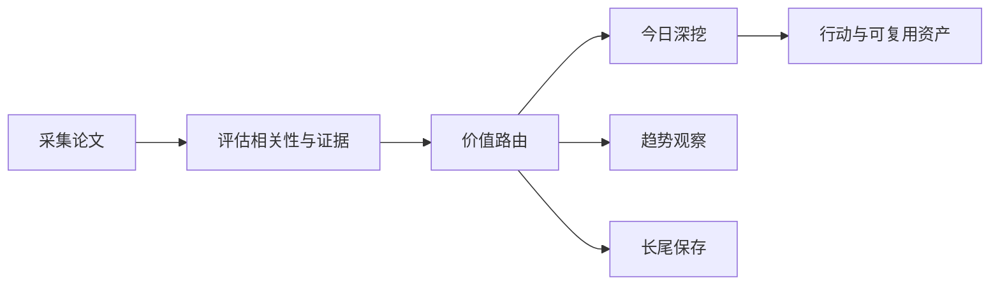

# 前沿理论驱动技术雷达

<h3 align="center">用可追溯证据判断：哪些前沿 AI 论文现在值得行动、哪些值得观察、哪些应当暂缓。</h3>

<p align="center">
  每日完成论文采集、价值路由、深度判断与趋势沉淀，区分即时价值、趋势价值、长尾价值与噪声。
</p>

<p align="center">
  <a href="README.md">English</a> ·
  <a href="https://radar.aiutil.com">在线雷达</a> ·
  <a href="https://radar.aiutil.com/daily.html">日报</a> ·
  <a href="https://radar.aiutil.com/about.html">研究方法</a>
</p>

<p align="center">
  <a href="https://github.com/aiutil/frontier-theory-radar/actions/workflows/ci.yml"></a>
  <a href="LICENSE"></a>
  
</p>


## 最新研究 · 2026-08-13

| 审阅论文 | 即时价值 | 趋势价值 | 长尾价值 | 暂时忽略 |
| ---: | ---: | ---: | ---: | ---: |
| 10 | 90 | 120 | 109 | 931 |

**今日深挖：** [Test-Time Self-Evolving GUI Visual Grounding via Reflection-Guided On-Policy Self-Distillation](daily/2026/2026-08-13.md) · 即时价值 · 轻量试点

**核心判断：** Test-Time Self-Evolving 解决一个实际部署瓶颈——GUI agent 模型冻结后无法适配未见界面，其'探索→反思→on-policy 自蒸馏'闭环无需人工标注即可运行，直接关系 GUI/自动化 agent 的部署鲁棒性。How to Verify Consistency of Probabilistic Claims 把'AI 是否诚实报告概率'从信任问题变成可验证的密码学问题（interactive PCP），且作者阵容极强（Bengio + Goldwasser 图灵奖级），对 AI 安全/治理方向是强信号。Surgical WAM 代表世界模型范式向更多具身场景的扩展——用廉价视频替代昂贵动作标注来学习操作策略。

**建议动作：** 完成三件事：评估 Test-Time Self-Evolving 的'探索→反思→自蒸馏'闭环能否迁移到团队的 GUI/自动化 agent 场景——盘点现有部署后自适应方案的盲区（是否有反思信号、自蒸馏是否稳定、对新界面的适配质量如何）；为 How to Verify Consistency 建立趋势观察卡片（跟踪是否有从理论到 LLM 概率验证的工程化跟进，关注 Bengio/Goldwasser 后续工作）；评估 Surgical WAM 的世界模型范式在团队具身/多模态场景上的适用性（是否有廉价视频源可替代昂贵标注）。


## 最近 7 期日报

| 日期 | 深挖论文 | 价值类型 | 判断 |
| --- | --- | --- | --- |
| [2026-08-13](daily/2026/2026-08-13.md) | Test-Time Self-Evolving GUI Visual Grounding via Reflection-Guided On-Policy Self-Distillation | 即时价值 | 轻量试点 |
| [2026-08-12](daily/2026/2026-08-12.md) | Dynamic Coalition Formation and Communication Pricing in Skill-Based Agentic AI Systems | 即时价值 | 轻量试点 |
| [2026-08-11](daily/2026/2026-08-11.md) | CoinRAG: Contextualized Information Nugget KV Cache Reuse for Long-Context RAG | 即时价值 | 轻量试点 |
| [2026-08-10](daily/2026/2026-08-10.md) | The Bitter Lesson of Tool Calling | 即时价值 | 轻量试点 |
| [2026-08-09](daily/2026/2026-08-09.md) | The Bitter Lesson of Tool Calling | 即时价值 | 轻量试点 |
| [2026-08-08](daily/2026/2026-08-08.md) | The Bitter Lesson of Tool Calling | 即时价值 | 轻量试点 |
| [2026-08-07](daily/2026/2026-08-07.md) | Argus: A General-Purpose Agentic Runtime for Long-Horizon Reasoning | 即时价值 | 重点学习 |

## 当前重点趋势

| 方向 | 阶段 | 关联论文 |
| --- | --- | ---: |
| [Agentic World Modeling](https://radar.aiutil.com/trend-detail.html?id=agentic-world-modeling) | 上升 | 422 |
| [Coding Agent](https://radar.aiutil.com/trend-detail.html?id=coding-agent) | 主流化 | 356 |
| [Context Engineering](https://radar.aiutil.com/trend-detail.html?id=context-engineering) | 上升 | 422 |

## 为什么做这个项目

论文聚合站通常优化“新”和“热”，本项目优化“判断”：哪些值得今天试验，哪些需要连续观察，哪些虽然不热但应该保留，哪些证据不足应明确暂缓。每个结论都保留来源，并写清当前最大不确定性。

## 研究工作流



- `papers/`：按日期保存来源快照和评分候选。
- `daily/`：保存每次研究运行的人类可读判断记录。
- `trends/`、`insights/`：沉淀跨日趋势与可复用发现。
- `docs/data/`：在线站点使用的结构化公开投影。
- `scripts/generate_readme.py`：从已提交证据生成双语 README 和活动图表。

## 证据边界

评分与结论属于研究判断，不等于独立复现。论文摘要、作者自述 Benchmark、开源实现与第三方复现是不同证据等级。代码缺失、摘要截断或 Benchmark 未核验时，会明确标注，不把推断包装成事实。

## 本地运行与验证

```bash
./run_daily.sh 2026-08-07
python3 -m pytest tests
python3 scripts/generate_readme.py
```

生产定时任务运行在 AIUtil 私有自动化环境中，凭据和私有运行记忆不进入本仓库。生成后的 Markdown、SVG、JSON 和来源链接均可通过 Git 历史审阅。

## 安全

请勿提交数据源凭据、API Token、私有论文集合或运营记忆。安全问题请通过 [GitHub Security Advisories](https://github.com/aiutil/frontier-theory-radar/security/advisories/new) 私下报告。

## 开源协议

Apache License 2.0，详见 [NOTICE](NOTICE)。
