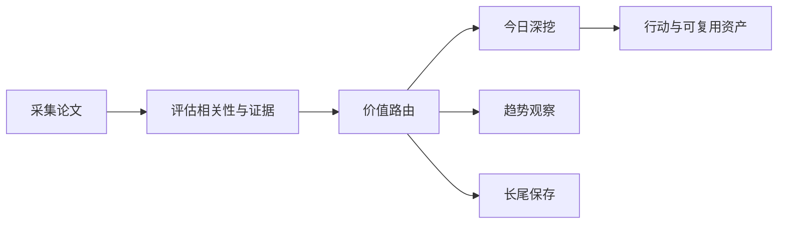

# 前沿理论驱动技术雷达

<h3 align="center">用可追溯证据判断：哪些前沿 AI 论文现在值得行动、哪些值得观察、哪些应当暂缓。</h3>

<p align="center">
  每日完成论文采集、价值路由、深度判断与趋势沉淀，区分即时价值、趋势价值、长尾价值与噪声。
</p>

<p align="center">
  <a href="README.md">English</a> ·
  <a href="https://radar.aiutil.com">在线雷达</a> ·
  <a href="https://radar.aiutil.com/daily.html">日报</a> ·
  <a href="https://radar.aiutil.com/about.html">研究方法</a>
</p>

<p align="center">
  <a href="https://github.com/aiutil/frontier-theory-radar/actions/workflows/ci.yml"></a>
  <a href="LICENSE"></a>
  
</p>


## 最新研究 · 2026-09-03

| 审阅论文 | 即时价值 | 趋势价值 | 长尾价值 | 暂时忽略 |
| ---: | ---: | ---: | ---: | ---: |
| 10 | 105 | 144 | 131 | 1300 |

**今日深挖：** [The Structure of Quantization Damage in LLMs: Why the Next Bit Should Be Spent Globally](daily/2026/2026-09-03.md) · 即时价值 · 轻量试点

**核心判断：** 据摘要，The Structure of Quantization Damage in LLMs（[2609.01587](http://arxiv.org/abs/2609.01587v1)）把 PTQ 从'逐模型调优'推到'causal mixed-precision intervention as ground truth + 跨 9 模型 4 家族结构化假设检验'，直接回答'额外精度 bit 应花在哪里'——证据级别提到因果干预层，能立刻用于 serving 栈精度预算分配。Verbal Reinforcement Learning（[2609.01597](http://arxiv.org/abs/2609.01597v1)）给出 VRL 的 first unified account——按 lifecycle 时机 × 改动对象统一组织，提供了把现有 LLM feedback 技巧按 lifecycle 排序的统一视角，便于评估与教学。PTA-IRT（[2609.01603](http://arxiv.org/abs/2609.01603v1)）把 SWE agent 评测从'result-only subset selection'推到'Privileged Trajectory-Aware IRT'，直击 SWE agent 评估贵的行业瓶颈——它既利用解题轨迹又控制成本。三篇 immediate 共同指向'为既有做法提供结构化底层原理'。趋势层：CordisBench（[2609.01600](http://arxiv.org/abs/2609.01600v1)）把'动态 agent harness 的 lifecycle reasoning'做成 1,200 题 benchmark + Cordis runtime——与昨日 Logos（2608.28553）的 cross-process bus 故障隔离形成'agent harness 治理与生命周期'趋势簇；Beyond Scores（[2609.01604](http://arxiv.org/abs/2609.01604v1)）用 8 类扰动 taxonomy + paired clean/corrupt + token 级标注把 LLM-as-a-Judge 从'score 输出'推到'mechanism 理解'；Adaptive Critical Token（[2609.01601](http://arxiv.org/abs/2609.01601v1)）把仓库级代码生成 RAG 从'task-level support'推到'critical-token aware retrieval'；Facet-0（[2609.01596](http://arxiv.org/abs/2609.01596v1)）围绕 joint action-wrench proposal 统一多模态表征与 RL 后训练——与昨日 Aero Hand Open 的仿真资产化互补。

**建议动作：** 2026-09-03 回看 | 完成五件事：(1) 跟踪 Quantization Damage 的具体结论与开源——评估其'causal mixed-precision intervention'是否可立刻用于团队 LLM serving 精度预算分配（30 分钟可在自己 serving 栈的 1-2 个开源模型上做 per-layer 8-bit 升精度实验，1 周内可实施）；(2) 把 Verbal RL 的'按 lifecycle 时机 × 改动对象'两轴作为评估现有 agent feedback 技巧的结构化视角（30 分钟可对团队当前 agent 的 verbal feedback 用例做两轴定位）；(3) 跟踪 PTA-IRT 是否开源——若开源，评估其'trajectory-aware IRT'是否能用于团队 SWE agent benchmark 成本压缩（30 分钟可梳理现有评估是否仅利用结果信息、识别轨迹信息的潜在价值）；(4) 把 CordisBench 纳入 agent harness 治理与生命周期趋势观察线（与昨日 Logos 形成簇），并跟踪 Beyond Scores / Adaptive Critical Token / Facet-0 的开源与定量结果；(5) 为 Mechanism Design / Proactive Thought Partners / StudentSim 三个长尾候选建立长尾观察卡片，并标注各自的开源/benchmark 跟踪信号。


## 最近 7 期日报

| 日期 | 深挖论文 | 价值类型 | 判断 |
| --- | --- | --- | --- |
| [2026-09-03](daily/2026/2026-09-03.md) | The Structure of Quantization Damage in LLMs: Why the Next Bit Should Be Spent Globally | 即时价值 | 轻量试点 |
| [2026-09-02](daily/2026/2026-09-02.md) | Configurable Semantic Chunking for Biomedical Information Extraction in Retrieval-Augmented Generation | 暂时忽略 | 暂时忽略 |
| [2026-09-01](daily/2026/2026-09-01.md) | PULSAR: Pooled Unified Late-Interaction Search and Retrieval for Enterprise Visual Document RAG | 即时价值 | 轻量试点 |
| [2026-08-30](daily/2026/2026-08-30.md) | WikiSkill: Compiling Agent Experience into Persistent Knowledge for Skill Evolution | 即时价值 | 轻量试点 |
| [2026-08-29](daily/2026/2026-08-29.md) | WikiSkill: Compiling Agent Experience into Persistent Knowledge for Skill Evolution | 即时价值 | 轻量试点 |
| [2026-08-28](daily/2026/2026-08-28.md) | PlanSightRAG: A Visual-First Multimodal RAG for Automating Question Answering and Compliance Checking for Civil Standard Plans | 暂时忽略 | 暂时忽略 |
| [2026-08-27](daily/2026/2026-08-27.md) | Recursive Experiential-Working Memory Evolution for Long-Horizon Agent Harnesses | 即时价值 | 轻量试点 |

## 当前重点趋势

| 方向 | 阶段 | 关联论文 |
| --- | --- | ---: |
| [Agentic World Modeling](https://radar.aiutil.com/trend-detail.html?id=agentic-world-modeling) | 上升 | 547 |
| [Coding Agent](https://radar.aiutil.com/trend-detail.html?id=coding-agent) | 主流化 | 453 |
| [Context Engineering](https://radar.aiutil.com/trend-detail.html?id=context-engineering) | 上升 | 547 |

## 为什么做这个项目

论文聚合站通常优化“新”和“热”，本项目优化“判断”：哪些值得今天试验，哪些需要连续观察，哪些虽然不热但应该保留，哪些证据不足应明确暂缓。每个结论都保留来源，并写清当前最大不确定性。

## 研究工作流



- `papers/`：按日期保存来源快照和评分候选。
- `daily/`：保存每次研究运行的人类可读判断记录。
- `trends/`、`insights/`：沉淀跨日趋势与可复用发现。
- `docs/data/`：在线站点使用的结构化公开投影。
- `scripts/generate_readme.py`：从已提交证据生成双语 README 和活动图表。

## 证据边界

评分与结论属于研究判断，不等于独立复现。论文摘要、作者自述 Benchmark、开源实现与第三方复现是不同证据等级。代码缺失、摘要截断或 Benchmark 未核验时，会明确标注，不把推断包装成事实。

## 本地运行与验证

```bash
./run_daily.sh 2026-08-07
python3 -m pytest tests
python3 scripts/generate_readme.py
```

生产定时任务运行在 AIUtil 私有自动化环境中，凭据和私有运行记忆不进入本仓库。生成后的 Markdown、SVG、JSON 和来源链接均可通过 Git 历史审阅。

## 安全

请勿提交数据源凭据、API Token、私有论文集合或运营记忆。安全问题请通过 [GitHub Security Advisories](https://github.com/aiutil/frontier-theory-radar/security/advisories/new) 私下报告。

## 开源协议

Apache License 2.0，详见 [NOTICE](NOTICE)。
