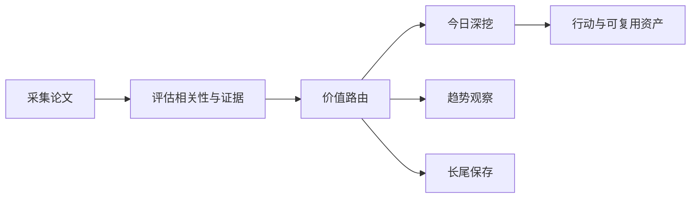

# 前沿理论驱动技术雷达

<h3 align="center">用可追溯证据判断：哪些前沿 AI 论文现在值得行动、哪些值得观察、哪些应当暂缓。</h3>

<p align="center">
  每日完成论文采集、价值路由、深度判断与趋势沉淀，区分即时价值、趋势价值、长尾价值与噪声。
</p>

<p align="center">
  <a href="README.md">English</a> ·
  <a href="https://radar.aiutil.com">在线雷达</a> ·
  <a href="https://radar.aiutil.com/daily.html">日报</a> ·
  <a href="https://radar.aiutil.com/about.html">研究方法</a>
</p>

<p align="center">
  <a href="https://github.com/aiutil/frontier-theory-radar/actions/workflows/ci.yml"></a>
  <a href="LICENSE"></a>
  
</p>


## 最新研究 · 2026-09-25

| 审阅论文 | 即时价值 | 趋势价值 | 长尾价值 | 暂时忽略 |
| ---: | ---: | ---: | ---: | ---: |
| 10 | 111 | 193 | 187 | 1319 |

**今日深挖：** [Ovis-Embedding: Pushing the Frontiers of Universal Omni-Modal Embeddings](daily/2026/2026-09-25.md) · 即时价值 · 重点学习

**核心判断：** 据摘要（arXiv 2609.25165），这篇提出 native omni-modal embedding——text/image/video/audio 共享一个 multimodal backbone，不再'组装'单独的 modality tower，并声称三项关键进展：(1) native omni-modal initialization（用预训练 Qwen-omni 做 embedding backbone 并适配）、(2) shared representation space、(3) 把 embedding 用作检索/RAG/分类的统一接口。这是 multimodal-agent × inference-serving × llm-evaluation 的'工程交付'直接路线：embedding 是 RAG/检索/分类的基石，'omni-modal + shared backbone'若工程可行，会直接降低多模态检索/分类系统的部署复杂度（不再维护多套 modality-specific encoder）。⚠️ 重要观察：今日 RSS 拉取的 URL 集合（2609.25010-2609.25284）与昨日（2026-09-24）完全相同，并非 9 月 25 日新 announce 的论文——这是 arXiv API 连续第六日返回 HTTP 406 后、RSS 在 archive 层面的滞后。价值路由沿用昨日已铺设判断，今日核心动作不是重铺链路，而是观察 arXiv 是否恢复 API、是否会出现与昨日不重叠的新批次。

**建议动作：** 把 Ovis-Embedding（[2609.25165](http://arxiv.org/abs/2609.25165)）继续列为即时试点方向（沿用昨日判断）；为 X-Planner（[2609.25187](http://arxiv.org/abs/2609.25187)）、4DGS-JEPA（[2609.25036](http://arxiv.org/abs/2609.25036)）维持趋势卡片（与 9 月 23 日 GameHorizon / WorldCrafter 形成双联证据）；为 AI Neuroscientist（[2609.25254](http://arxiv.org/abs/2609.25254)）、MedGate-Fusion（[2609.25272](http://arxiv.org/abs/2609.25272)）、ReAdapt（[2609.25284](http://arxiv.org/abs/2609.25284)）、Do Synthetic Personas（[2609.25010](http://arxiv.org/abs/2609.25010)）、TabPFN Preconditioner Study（[2609.25013](http://arxiv.org/abs/2609.25013)）、Hyper GNN for GBM（[2609.25088](http://arxiv.org/abs/2609.25088)）、Lean Pool（[2609.25199](http://arxiv.org/abs/2609.25199)）维持长尾卡片。⚠️ 今日特别关注：观察 arXiv 是否恢复 API、是否会出现与昨日不重叠的新批次。


## 最近 7 期日报

| 日期 | 深挖论文 | 价值类型 | 判断 |
| --- | --- | --- | --- |
| [2026-09-25](daily/2026/2026-09-25.md) | Ovis-Embedding: Pushing the Frontiers of Universal Omni-Modal Embeddings | 即时价值 | 重点学习 |
| [2026-09-24](daily/2026/2026-09-24.md) | Ovis-Embedding: Pushing the Frontiers of Universal Omni-Modal Embeddings | 即时价值 | 重点学习 |
| [2026-09-23](daily/2026/2026-09-23.md) | Harness-Zero: Harness Distillation via Agent-as-Harness | 即时价值 | 重点学习 |
| [2026-09-21](daily/2026/2026-09-21.md) | Quantifying Overclaiming Propensity in Frontier LLM Agents | 即时价值 | 重点学习 |
| [2026-09-20](daily/2026/2026-09-20.md) | Quantifying Overclaiming Propensity in Frontier LLM Agents | 即时价值 | 重点学习 |
| [2026-09-19](daily/2026/2026-09-19.md) | Quantifying Overclaiming Propensity in Frontier LLM Agents | 即时价值 | 重点学习 |
| [2026-09-18](daily/2026/2026-09-18.md) | Cognitive Extensions for Dual-Process Language Agents: Memory and Self-Reflection in Interactive Environments | 趋势价值 | 重点学习 |

## 当前重点趋势

| 方向 | 阶段 | 关联论文 |
| --- | --- | ---: |
| [Agentic World Modeling](https://radar.aiutil.com/trend-detail.html?id=agentic-world-modeling) | 上升 | 573 |
| [Coding Agent](https://radar.aiutil.com/trend-detail.html?id=coding-agent) | 主流化 | 516 |
| [Context Engineering](https://radar.aiutil.com/trend-detail.html?id=context-engineering) | 上升 | 573 |

## 为什么做这个项目

论文聚合站通常优化“新”和“热”，本项目优化“判断”：哪些值得今天试验，哪些需要连续观察，哪些虽然不热但应该保留，哪些证据不足应明确暂缓。每个结论都保留来源，并写清当前最大不确定性。

## 研究工作流



- `papers/`：按日期保存来源快照和评分候选。
- `daily/`：保存每次研究运行的人类可读判断记录。
- `trends/`、`insights/`：沉淀跨日趋势与可复用发现。
- `docs/data/`：在线站点使用的结构化公开投影。
- `scripts/generate_readme.py`：从已提交证据生成双语 README 和活动图表。

## 证据边界

评分与结论属于研究判断，不等于独立复现。论文摘要、作者自述 Benchmark、开源实现与第三方复现是不同证据等级。代码缺失、摘要截断或 Benchmark 未核验时，会明确标注，不把推断包装成事实。

## 本地运行与验证

```bash
./run_daily.sh 2026-08-07
python3 -m pytest tests
python3 scripts/generate_readme.py
```

生产定时任务运行在 AIUtil 私有自动化环境中，凭据和私有运行记忆不进入本仓库。生成后的 Markdown、SVG、JSON 和来源链接均可通过 Git 历史审阅。

## 安全

请勿提交数据源凭据、API Token、私有论文集合或运营记忆。安全问题请通过 [GitHub Security Advisories](https://github.com/aiutil/frontier-theory-radar/security/advisories/new) 私下报告。

## 开源协议

Apache License 2.0，详见 [NOTICE](NOTICE)。
