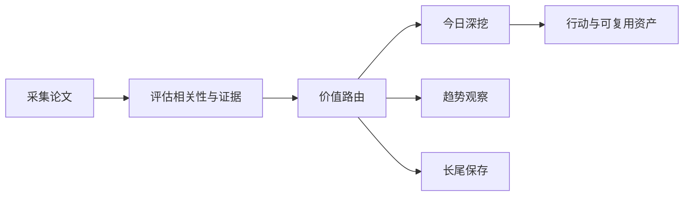

# 前沿理论驱动技术雷达

<h3 align="center">用可追溯证据判断：哪些前沿 AI 论文现在值得行动、哪些值得观察、哪些应当暂缓。</h3>

<p align="center">
  每日完成论文采集、价值路由、深度判断与趋势沉淀，区分即时价值、趋势价值、长尾价值与噪声。
</p>

<p align="center">
  <a href="README.md">English</a> ·
  <a href="https://radar.aiutil.com">在线雷达</a> ·
  <a href="https://radar.aiutil.com/daily.html">日报</a> ·
  <a href="https://radar.aiutil.com/about.html">研究方法</a>
</p>

<p align="center">
  <a href="https://github.com/aiutil/frontier-theory-radar/actions/workflows/ci.yml"></a>
  <a href="LICENSE"></a>
  
</p>


## 最新研究 · 2026-08-11

| 审阅论文 | 即时价值 | 趋势价值 | 长尾价值 | 暂时忽略 |
| ---: | ---: | ---: | ---: | ---: |
| 10 | 86 | 114 | 104 | 926 |

**今日深挖：** [CoinRAG: Contextualized Information Nugget KV Cache Reuse for Long-Context RAG](daily/2026/2026-08-11.md) · 即时价值 · 轻量试点

**核心判断：** CoinRAG 把 RAG 的 KV cache 复用从 chunk 级降到 information nugget 级，在低 prefill 延迟约束下优化准确率-延迟 Pareto 前沿——回答了'RAG 检索上下文的缓存复用该做到多细'。SkillProx 用 proximal textual gradient descent 让 agent 技能自演化，引入显式 diagnosis-outcome 反馈并把删除作为一等公民机制——把 agent 技能管理从手动维护推向自动优化。Blast Radius 为 agentic coding 提供预测式内存管理层（估算 prompt reach + 可逆逐出 + 反复死内容识别），直接解决 coding agent 的 token 浪费与上下文膨胀。三者都是'今天就值得在工程上试'的工作。

**建议动作：** 完成三件事：评估 CoinRAG 的 nugget 级 KV cache 复用思路能否接入现有 RAG 流水线（对比 chunk 级 vs 更细粒度的延迟-准确率权衡）；在团队技能库上设计 SkillProx proximal textual gradient descent 的概念验证（手动维护 vs 自动演化技能质量对比）；评估 Blast Radius 的预测式内存管理能否降低现有 coding agent 的 token 成本。为 CreativeInstruct（质量-创造力平衡）、Taxonomy-Driven（风险工具地图）、Interaction（多智能体涌现动力学）维持趋势观察卡片。


## 最近 7 期日报

| 日期 | 深挖论文 | 价值类型 | 判断 |
| --- | --- | --- | --- |
| [2026-08-11](daily/2026/2026-08-11.md) | CoinRAG: Contextualized Information Nugget KV Cache Reuse for Long-Context RAG | 即时价值 | 轻量试点 |
| [2026-08-10](daily/2026/2026-08-10.md) | The Bitter Lesson of Tool Calling | 即时价值 | 轻量试点 |
| [2026-08-09](daily/2026/2026-08-09.md) | The Bitter Lesson of Tool Calling | 即时价值 | 轻量试点 |
| [2026-08-08](daily/2026/2026-08-08.md) | The Bitter Lesson of Tool Calling | 即时价值 | 轻量试点 |
| [2026-08-07](daily/2026/2026-08-07.md) | Argus: A General-Purpose Agentic Runtime for Long-Horizon Reasoning | 即时价值 | 重点学习 |
| [2026-08-06](daily/2026/2026-08-06.md) | When Attention Goes Blind: Numerical Failure in ALiBi Positional Encodings | 即时价值 | 重点学习 |
| [2026-08-05](daily/2026/2026-08-05.md) | UEmbed: Unified Sparse and Dense Multimodal Embeddings | 即时价值 | 重点学习 |

## 当前重点趋势

| 方向 | 阶段 | 关联论文 |
| --- | --- | ---: |
| [Agentic World Modeling](https://radar.aiutil.com/trend-detail.html?id=agentic-world-modeling) | 上升 | 419 |
| [Coding Agent](https://radar.aiutil.com/trend-detail.html?id=coding-agent) | 主流化 | 347 |
| [Context Engineering](https://radar.aiutil.com/trend-detail.html?id=context-engineering) | 上升 | 419 |

## 为什么做这个项目

论文聚合站通常优化“新”和“热”，本项目优化“判断”：哪些值得今天试验，哪些需要连续观察，哪些虽然不热但应该保留，哪些证据不足应明确暂缓。每个结论都保留来源，并写清当前最大不确定性。

## 研究工作流



- `papers/`：按日期保存来源快照和评分候选。
- `daily/`：保存每次研究运行的人类可读判断记录。
- `trends/`、`insights/`：沉淀跨日趋势与可复用发现。
- `docs/data/`：在线站点使用的结构化公开投影。
- `scripts/generate_readme.py`：从已提交证据生成双语 README 和活动图表。

## 证据边界

评分与结论属于研究判断，不等于独立复现。论文摘要、作者自述 Benchmark、开源实现与第三方复现是不同证据等级。代码缺失、摘要截断或 Benchmark 未核验时，会明确标注，不把推断包装成事实。

## 本地运行与验证

```bash
./run_daily.sh 2026-08-07
python3 -m pytest tests
python3 scripts/generate_readme.py
```

生产定时任务运行在 AIUtil 私有自动化环境中，凭据和私有运行记忆不进入本仓库。生成后的 Markdown、SVG、JSON 和来源链接均可通过 Git 历史审阅。

## 安全

请勿提交数据源凭据、API Token、私有论文集合或运营记忆。安全问题请通过 [GitHub Security Advisories](https://github.com/aiutil/frontier-theory-radar/security/advisories/new) 私下报告。

## 开源协议

Apache License 2.0，详见 [NOTICE](NOTICE)。
