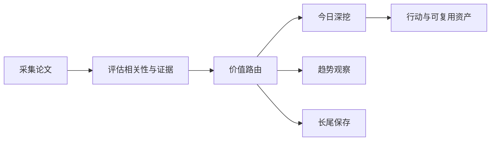

# 前沿理论驱动技术雷达

<h3 align="center">用可追溯证据判断：哪些前沿 AI 论文现在值得行动、哪些值得观察、哪些应当暂缓。</h3>

<p align="center">
  每日完成论文采集、价值路由、深度判断与趋势沉淀，区分即时价值、趋势价值、长尾价值与噪声。
</p>

<p align="center">
  <a href="README.md">English</a> ·
  <a href="https://radar.aiutil.com">在线雷达</a> ·
  <a href="https://radar.aiutil.com/daily.html">日报</a> ·
  <a href="https://radar.aiutil.com/about.html">研究方法</a>
</p>

<p align="center">
  <a href="https://github.com/aiutil/frontier-theory-radar/actions/workflows/ci.yml"></a>
  <a href="LICENSE"></a>
  
</p>


## 最新研究 · 2026-09-04

| 审阅论文 | 即时价值 | 趋势价值 | 长尾价值 | 暂时忽略 |
| ---: | ---: | ---: | ---: | ---: |
| 10 | 107 | 148 | 135 | 1300 |

**今日深挖：** [Post-Training Language Models for Gold-Medal Performance in Coding Competitions](daily/2026/2026-09-04.md) · 即时价值 · 重点学习

**核心判断：** 据摘要，The Implications of Linguistic Illegibility for LLM Security（[2609.02852](http://arxiv.org/abs/2609.02852v1)）提出 'linguistic illegibility' 概念——LLM 的外部化语言输出与 mechanistic-extracted 语言特征可能是理解内部计算的不可靠 lens，论证其对 LLM security 的影响；直接连接到 jailbreak / prompt injection / interpretability 鲁棒性等安全场景，与昨日 Beyond Scores（[2609.01604](http://arxiv.org/abs/2609.01604v1)）的 LLM-as-a-Judge 机制扰动分析形成'评测机制可读性 + 模型内部可读性'双线索。Post-Training Language Models for Gold-Medal Performance in Coding Competitions（[2609.02849](http://arxiv.org/abs/2609.02849v1)）呈现 end-to-end specialization pipeline——22K curated problems + synthetic reasoning traces + SFT/RL 组合，训练 Nemotron-3-Nano-CC（30B-A3B，SFT+RL）与 Nemotron-3-Ultra-CC（550B-A55B，仅 SFT），目标 IOI/ICPC gold-medal。两篇 immediate 共同指向'为既有抽象问题提供结构化诊断术语 + 把 LLM 极限能力工程化'。趋势层：Discriminative World Models for Web Agents（[2609.02885](http://arxiv.org/abs/2609.02885v1)）把 web agent 世界模型从'supervised next-state prediction'推到'discriminative objective'——训练目标与下游 ranker 对齐；UE5M3 FP4 Block Scaling（[2609.02846](http://arxiv.org/abs/2609.02846v1)）把 FP4 预训练稳定性从'current-tensor scaling + RHT + BF16'（NVIDIA Transformer Engine）推到'UE5M3 block scales + periodic tensor scaling'；User Feedback Provides a Unique Signal（[2609.02859](http://arxiv.org/abs/2609.02859v1)）挑战'user feedback 噪声大'共识，证明评测范式 systematic bias 掩盖了真实价值；Graph Machine（[2609.02881](http://arxiv.org/abs/2609.02881v1)）用 edges-based sparse dynamic routing 替换 Qwen 75% dense attention。

**建议动作：** 2026-09-04 回看 | 完成五件事：(1) 跟踪 Linguistic Illegibility 的具体 security 论证与 jailbreak 案例——评估其'unified diagnostic framework'对团队 LLM 安全评审的可借鉴性（30 分钟可对团队现有 LLM 安全评审流程检查'是否把外部语言当作内部解释'）；(2) 跟踪 Nemotron Gold-Medal Coding 的开源与 22K problems 数据工程——评估其'22K curated problems + synthetic reasoning traces'对团队 coding agent 训练数据 curation 流程的可借鉴性（30 分钟可梳理团队 coding agent 训练数据的 curation 过滤规则）；(3) 把 Discriminative World Models 纳入 web agent 训练目标观察线——评估其'discriminative objective'对团队 web agent / GUI agent 世界模型的可借鉴性；(4) 把 UE5M3 FP4 纳入低精度预训练稳定性观察线——评估其'UE5M3 block scales'对团队 FP4 预训练栈的可借鉴性；(5) 为 Speech BCI / TRACE / GRADSOLVE / GD Lower Bounds 四个长尾候选建立长尾观察卡片，并标注各自的开源/benchmark 跟踪信号。


## 最近 7 期日报

| 日期 | 深挖论文 | 价值类型 | 判断 |
| --- | --- | --- | --- |
| [2026-09-04](daily/2026/2026-09-04.md) | Post-Training Language Models for Gold-Medal Performance in Coding Competitions | 即时价值 | 重点学习 |
| [2026-09-03](daily/2026/2026-09-03.md) | The Structure of Quantization Damage in LLMs: Why the Next Bit Should Be Spent Globally | 即时价值 | 轻量试点 |
| [2026-09-02](daily/2026/2026-09-02.md) | Configurable Semantic Chunking for Biomedical Information Extraction in Retrieval-Augmented Generation | 暂时忽略 | 暂时忽略 |
| [2026-09-01](daily/2026/2026-09-01.md) | PULSAR: Pooled Unified Late-Interaction Search and Retrieval for Enterprise Visual Document RAG | 即时价值 | 轻量试点 |
| [2026-08-30](daily/2026/2026-08-30.md) | WikiSkill: Compiling Agent Experience into Persistent Knowledge for Skill Evolution | 即时价值 | 轻量试点 |
| [2026-08-29](daily/2026/2026-08-29.md) | WikiSkill: Compiling Agent Experience into Persistent Knowledge for Skill Evolution | 即时价值 | 轻量试点 |
| [2026-08-28](daily/2026/2026-08-28.md) | PlanSightRAG: A Visual-First Multimodal RAG for Automating Question Answering and Compliance Checking for Civil Standard Plans | 暂时忽略 | 暂时忽略 |

## 当前重点趋势

| 方向 | 阶段 | 关联论文 |
| --- | --- | ---: |
| [Agentic World Modeling](https://radar.aiutil.com/trend-detail.html?id=agentic-world-modeling) | 上升 | 547 |
| [Coding Agent](https://radar.aiutil.com/trend-detail.html?id=coding-agent) | 主流化 | 456 |
| [Context Engineering](https://radar.aiutil.com/trend-detail.html?id=context-engineering) | 上升 | 547 |

## 为什么做这个项目

论文聚合站通常优化“新”和“热”，本项目优化“判断”：哪些值得今天试验，哪些需要连续观察，哪些虽然不热但应该保留，哪些证据不足应明确暂缓。每个结论都保留来源，并写清当前最大不确定性。

## 研究工作流



- `papers/`：按日期保存来源快照和评分候选。
- `daily/`：保存每次研究运行的人类可读判断记录。
- `trends/`、`insights/`：沉淀跨日趋势与可复用发现。
- `docs/data/`：在线站点使用的结构化公开投影。
- `scripts/generate_readme.py`：从已提交证据生成双语 README 和活动图表。

## 证据边界

评分与结论属于研究判断，不等于独立复现。论文摘要、作者自述 Benchmark、开源实现与第三方复现是不同证据等级。代码缺失、摘要截断或 Benchmark 未核验时，会明确标注，不把推断包装成事实。

## 本地运行与验证

```bash
./run_daily.sh 2026-08-07
python3 -m pytest tests
python3 scripts/generate_readme.py
```

生产定时任务运行在 AIUtil 私有自动化环境中，凭据和私有运行记忆不进入本仓库。生成后的 Markdown、SVG、JSON 和来源链接均可通过 Git 历史审阅。

## 安全

请勿提交数据源凭据、API Token、私有论文集合或运营记忆。安全问题请通过 [GitHub Security Advisories](https://github.com/aiutil/frontier-theory-radar/security/advisories/new) 私下报告。

## 开源协议

Apache License 2.0，详见 [NOTICE](NOTICE)。
