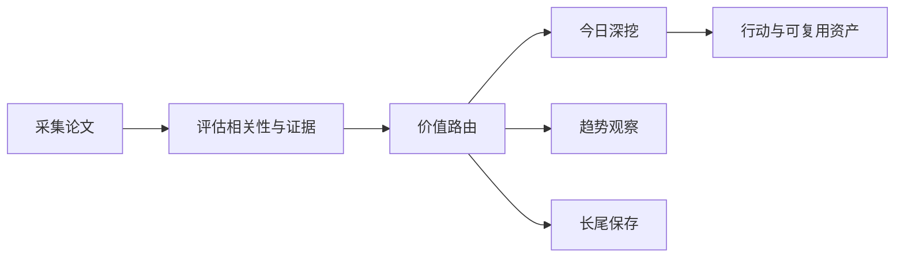

# 前沿理论驱动技术雷达

<h3 align="center">用可追溯证据判断：哪些前沿 AI 论文现在值得行动、哪些值得观察、哪些应当暂缓。</h3>

<p align="center">
  每日完成论文采集、价值路由、深度判断与趋势沉淀，区分即时价值、趋势价值、长尾价值与噪声。
</p>

<p align="center">
  <a href="README.md">English</a> ·
  <a href="https://radar.aiutil.com">在线雷达</a> ·
  <a href="https://radar.aiutil.com/daily.html">日报</a> ·
  <a href="https://radar.aiutil.com/about.html">研究方法</a>
</p>

<p align="center">
  <a href="https://github.com/aiutil/frontier-theory-radar/actions/workflows/ci.yml"></a>
  <a href="LICENSE"></a>
  
</p>


## 最新研究 · 2026-08-30

| 审阅论文 | 即时价值 | 趋势价值 | 长尾价值 | 暂时忽略 |
| ---: | ---: | ---: | ---: | ---: |
| 10 | 100 | 138 | 123 | 1289 |

**今日深挖：** [WikiSkill: Compiling Agent Experience into Persistent Knowledge for Skill Evolution](daily/2026/2026-08-30.md) · 即时价值 · 轻量试点

**核心判断：** WikiSkill 把分散在 trajectory/optimization history 里的洞察结构化沉淀为 wiki-style 持久知识，与昨日（8-27）Recuris 的 Working + Experiential 双层 memory 同方向——但更聚焦'skill 知识结构化'而非'memory 分层'；CritICL 利用小模型结构化失败模式做 ICL 桥接大模型，把弱模型从'答案提供者'变成'失败模式判别器'，可在不增加采样/外验证成本下提升推理质量；Persona-Execution Separation 把 persona 与 execution 显式分到不同 trust domain、用 governed contract bridge 桥接，直击企业 agent '可演化 vs 可审计'的核心冲突。三篇 immediate 共同把 AI 工程从'演示层'推向'经验沉淀 + 成本受限推理 + 合规治理'的运营层。三个趋势信号：TTPO 把 RL/OPSD 的 ground truth 依赖换成'利用多数/少数 rollout 不对称性'的推理时训练、SWE-Prime 把 SWE agent 训练从'采大量轨迹'转向'精选高质量轨迹'、RedEvoAgent 把红队 agent 攻击技能从'固定/检索'改为'经验驱动 skill evolution'。

**建议动作：** 2026-08-30 回看 | 完成三件事：(1) 跟踪 WikiSkill 开源——评估其持久知识结构是否可与团队 long-horizon agent 的 memory 抽象兼容，可在内部 agent 上做 'skill library + wiki knowledge' 概念验证（不依赖完整开源，知识结构化思想可借鉴，1 周内可做概念验证）；(2) 把 CritICL 的'失败模式判别器'思路纳入推理时成本治理设计——评估在内部任务上'小模型 ICL 桥接大模型'是否能省下重复采样/外验证成本（30 分钟可设计实验、1-2 天可实施）；(3) 把 PES 的 persona/execution trust domain 分离原则纳入企业 agent 合规架构评估清单（30 分钟可梳理要点，1 周内可在内部架构评审中应用）。


## 最近 7 期日报

| 日期 | 深挖论文 | 价值类型 | 判断 |
| --- | --- | --- | --- |
| [2026-08-30](daily/2026/2026-08-30.md) | WikiSkill: Compiling Agent Experience into Persistent Knowledge for Skill Evolution | 即时价值 | 轻量试点 |
| [2026-08-29](daily/2026/2026-08-29.md) | WikiSkill: Compiling Agent Experience into Persistent Knowledge for Skill Evolution | 即时价值 | 轻量试点 |
| [2026-08-28](daily/2026/2026-08-28.md) | PlanSightRAG: A Visual-First Multimodal RAG for Automating Question Answering and Compliance Checking for Civil Standard Plans | 暂时忽略 | 暂时忽略 |
| [2026-08-27](daily/2026/2026-08-27.md) | Recursive Experiential-Working Memory Evolution for Long-Horizon Agent Harnesses | 即时价值 | 轻量试点 |
| [2026-08-26](daily/2026/2026-08-26.md) | Prime Agent: A Self-Improving RLM Harness | 即时价值 | 轻量试点 |
| [2026-08-25](daily/2026/2026-08-25.md) | Natural-Language Workflows Are Not Software Yet: Artifact-Driven Compilation for Reliable Agent Execution | 即时价值 | 轻量试点 |
| [2026-08-24](daily/2026/2026-08-24.md) | AI4AI-Bench: Benchmarking LLM Agents in Algorithmic Design for Recursive Self-Improvement | 即时价值 | 轻量试点 |

## 当前重点趋势

| 方向 | 阶段 | 关联论文 |
| --- | --- | ---: |
| [Agentic World Modeling](https://radar.aiutil.com/trend-detail.html?id=agentic-world-modeling) | 上升 | 541 |
| [Coding Agent](https://radar.aiutil.com/trend-detail.html?id=coding-agent) | 主流化 | 444 |
| [Context Engineering](https://radar.aiutil.com/trend-detail.html?id=context-engineering) | 上升 | 541 |

## 为什么做这个项目

论文聚合站通常优化“新”和“热”，本项目优化“判断”：哪些值得今天试验，哪些需要连续观察，哪些虽然不热但应该保留，哪些证据不足应明确暂缓。每个结论都保留来源，并写清当前最大不确定性。

## 研究工作流



- `papers/`：按日期保存来源快照和评分候选。
- `daily/`：保存每次研究运行的人类可读判断记录。
- `trends/`、`insights/`：沉淀跨日趋势与可复用发现。
- `docs/data/`：在线站点使用的结构化公开投影。
- `scripts/generate_readme.py`：从已提交证据生成双语 README 和活动图表。

## 证据边界

评分与结论属于研究判断，不等于独立复现。论文摘要、作者自述 Benchmark、开源实现与第三方复现是不同证据等级。代码缺失、摘要截断或 Benchmark 未核验时，会明确标注，不把推断包装成事实。

## 本地运行与验证

```bash
./run_daily.sh 2026-08-07
python3 -m pytest tests
python3 scripts/generate_readme.py
```

生产定时任务运行在 AIUtil 私有自动化环境中，凭据和私有运行记忆不进入本仓库。生成后的 Markdown、SVG、JSON 和来源链接均可通过 Git 历史审阅。

## 安全

请勿提交数据源凭据、API Token、私有论文集合或运营记忆。安全问题请通过 [GitHub Security Advisories](https://github.com/aiutil/frontier-theory-radar/security/advisories/new) 私下报告。

## 开源协议

Apache License 2.0，详见 [NOTICE](NOTICE)。
