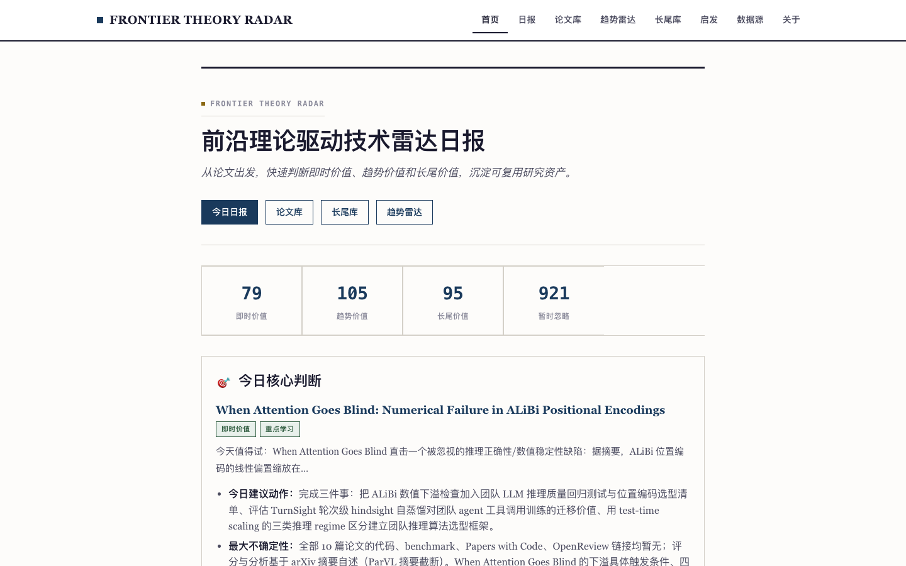
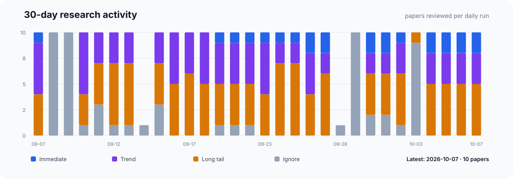
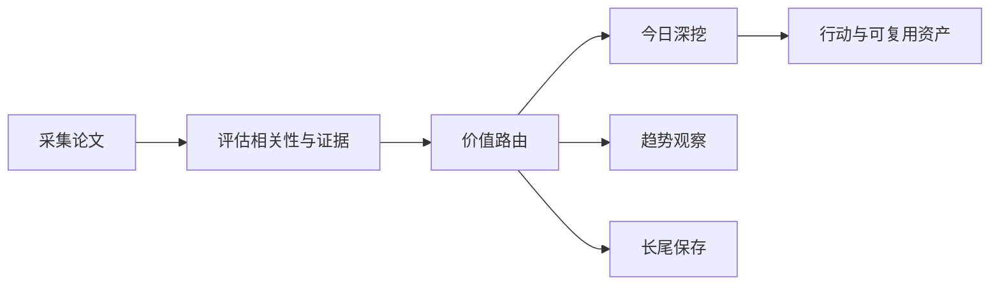

# 前沿理论驱动技术雷达

<h3 align="center">用可追溯证据判断：哪些前沿 AI 论文现在值得行动、哪些值得观察、哪些应当暂缓。</h3>

<p align="center">
  每日完成论文采集、价值路由、深度判断与趋势沉淀，区分即时价值、趋势价值、长尾价值与噪声。
</p>

<p align="center">
  <a href="README.md">English</a> ·
  <a href="https://radar.aiutil.com">在线雷达</a> ·
  <a href="https://radar.aiutil.com/daily.html">日报</a> ·
  <a href="https://radar.aiutil.com/about.html">研究方法</a>
</p>

<p align="center">
  <a href="https://github.com/aiutil/frontier-theory-radar/actions/workflows/ci.yml"></a>
  <a href="LICENSE"></a>
  
</p>



## 最新研究 · 2026-10-06

| 审阅论文 | 即时价值 | 趋势价值 | 长尾价值 | 暂时忽略 |
| ---: | ---: | ---: | ---: | ---: |
| 10 | 124 | 212 | 220 | 1334 |

**今日深挖：** [LESSER: Post-Training Data Selection with Output-Layer Gradients](daily/2026/2026-10-06.md) · 即时价值 · 轻量试点

**核心判断：** 据摘要（arXiv [2610.03702](http://arxiv.org/abs/2610.03702v1)），LESSER 把 LLM post-training data selection 的 ranking signal 从'full-parameter backward pass per sample'推到'output-layer gradients'——明确给出 fractional-cost 近似路径，在保留近似 full-gradient 信号的同时把 per-sample 算力压到常数倍。这是 inference-serving × llm-evaluation × memory 的 'output-layer gradient ranking' 即时价值资产 ——把'数据选择 ranking signal'从'full backward pass'拉到'output-layer as governance surface'，与昨日 / 上周 TACO（optimizer state memory compression）在'把训练时 memory/compute 维度变成可量化工程对象'层面同源，与 aiutil 长期关注的 inference-serving × memory × llm-evaluation 主线在'低成本 ranking signal for data curation'层面同源。

**建议动作：** 把 [2610.03702](http://arxiv.org/abs/2610.03702v1) LESSER 列为即时试点方向，写 'lesser output-layer data-selection' checklist 草稿；把 [2610.03715](http://arxiv.org/abs/2610.03715v1) 4DCodeBench 'physics-grounded 4D code agent' 同步列为即时路线资产，写 '4d-code-agent bench' checklist 草稿；为 [2610.03710](http://arxiv.org/abs/2610.03710v1) EyeRobot 2.0 'active foveal sensing'、[2610.03713](http://arxiv.org/abs/2610.03713v1) Stratified Retention 'world-model forgetting as feature'、[2610.03695](http://arxiv.org/abs/2610.03695v1) Queen chess-LM 'explainable domain-LM' 维持分类趋势卡片并设置 7 天观察周期；为 [2610.03717](http://arxiv.org/abs/2610.03717v1) Less Decoder More Encoder / 2610.03712 RNADyn / 2610.03709 Graph Decomposition / 2610.03679 Simulation-Free Lagrangian / 2610.03693 Transcriptome AI 维持长尾卡片；忽略无（今日 10 篇全部进入 value routing）。⚠️ 持续观察所有 10 篇是否开源 code / benchmark / project page；尤其关注 LESSER 是否公开 output-layer gradient 形式化、4DCodeBench 是否公开 physics simulation abstraction 集合。



## 最近 7 期日报

| 日期 | 深挖论文 | 价值类型 | 判断 |
| --- | --- | --- | --- |
| [2026-10-06](daily/2026/2026-10-06.md) | LESSER: Post-Training Data Selection with Output-Layer Gradients | 即时价值 | 轻量试点 |
| [2026-10-05](daily/2026/2026-10-05.md) | VISTA: A Visual Harness for Reasoning in an Interactive World | 即时价值 | 轻量试点 |
| [2026-10-04](daily/2026/2026-10-04.md) | VISTA: A Visual Harness for Reasoning in an Interactive World | 即时价值 | 轻量试点 |
| [2026-10-03](daily/2026/2026-10-03.md) | KaliBench: A Fine-Grained Benchmark for Cybersecurity Tool Use on Kali Linux with Runtime-Free Verifiable Rewards | 长尾价值 | 持续观察 |
| [2026-10-02](daily/2026/2026-10-02.md) | Turbo Harness: Instance-Adaptive Harness Optimization | 即时价值 | 轻量试点 |
| [2026-10-01](daily/2026/2026-10-01.md) | LeapQuant: Efficient Linear Attention with Accurate Recurrent State Quantization | 即时价值 | 重点学习 |
| [2026-09-30](daily/2026/2026-09-30.md) | TokenCast: Forecasting Token Consumption During LLM Agent Execution | 即时价值 | 重点学习 |

## 当前重点趋势

| 方向 | 阶段 | 关联论文 |
| --- | --- | ---: |
| [Agentic World Modeling](https://radar.aiutil.com/trend-detail.html?id=agentic-world-modeling) | 上升 | 590 |
| [Coding Agent](https://radar.aiutil.com/trend-detail.html?id=coding-agent) | 主流化 | 565 |
| [Context Engineering](https://radar.aiutil.com/trend-detail.html?id=context-engineering) | 上升 | 590 |

## 为什么做这个项目

论文聚合站通常优化“新”和“热”，本项目优化“判断”：哪些值得今天试验，哪些需要连续观察，哪些虽然不热但应该保留，哪些证据不足应明确暂缓。每个结论都保留来源，并写清当前最大不确定性。

## 研究工作流


```mermaid
flowchart LR
  A["采集论文"] --> B["评估相关性与证据"]
  B --> C["价值路由"]
  C --> D["今日深挖"]
  C --> E["趋势观察"]
  C --> F["长尾保存"]
  D --> G["行动与可复用资产"]
```

- `papers/`：按日期保存来源快照和评分候选。
- `daily/`：保存每次研究运行的人类可读判断记录。
- `trends/`、`insights/`：沉淀跨日趋势与可复用发现。
- `docs/data/`：在线站点使用的结构化公开投影。
- `scripts/generate_readme.py`：从已提交证据生成双语 README 和活动图表。

## 证据边界

评分与结论属于研究判断，不等于独立复现。论文摘要、作者自述 Benchmark、开源实现与第三方复现是不同证据等级。代码缺失、摘要截断或 Benchmark 未核验时，会明确标注，不把推断包装成事实。

## 本地运行与验证

```bash
./run_daily.sh 2026-08-07
python3 -m pytest tests
python3 scripts/generate_readme.py
```

生产定时任务运行在 AIUtil 私有自动化环境中，凭据和私有运行记忆不进入本仓库。生成后的 Markdown、SVG、JSON 和来源链接均可通过 Git 历史审阅。

## 安全

请勿提交数据源凭据、API Token、私有论文集合或运营记忆。安全问题请通过 [GitHub Security Advisories](https://github.com/aiutil/frontier-theory-radar/security/advisories/new) 私下报告。

## 开源协议

Apache License 2.0，详见 [NOTICE](NOTICE)。
