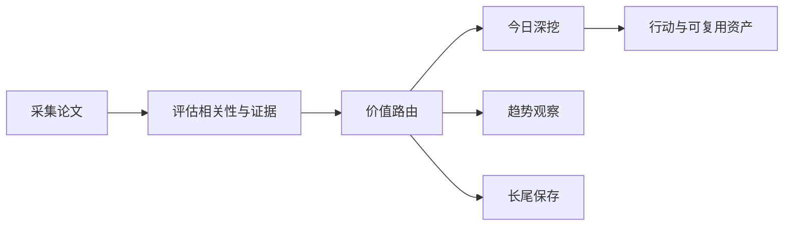

# 前沿理论驱动技术雷达

<h3 align="center">用可追溯证据判断：哪些前沿 AI 论文现在值得行动、哪些值得观察、哪些应当暂缓。</h3>

<p align="center">
  每日完成论文采集、价值路由、深度判断与趋势沉淀，区分即时价值、趋势价值、长尾价值与噪声。
</p>

<p align="center">
  <a href="README.md">English</a> ·
  <a href="https://radar.aiutil.com">在线雷达</a> ·
  <a href="https://radar.aiutil.com/daily.html">日报</a> ·
  <a href="https://radar.aiutil.com/about.html">研究方法</a>
</p>

<p align="center">
  <a href="https://github.com/aiutil/frontier-theory-radar/actions/workflows/ci.yml"></a>
  <a href="LICENSE"></a>
  
</p>


## 最新研究 · 2026-09-30

| 审阅论文 | 即时价值 | 趋势价值 | 长尾价值 | 暂时忽略 |
| ---: | ---: | ---: | ---: | ---: |
| 10 | 117 | 201 | 201 | 1331 |

**今日深挖：** [TokenCast: Forecasting Token Consumption During LLM Agent Execution](daily/2026/2026-09-30.md) · 即时价值 · 重点学习

**核心判断：** 据摘要（arXiv [2609.35760](http://arxiv.org/abs/2609.35760v1)），TokenCast 解决'同一任务 token 消耗跨 run 可变超一个数量级'这一对 agent 经济性的核心痛点，把 token consumption 建模为可组合的 cost model：可在执行前估计预算、随执行过程（context 增长 / tool feedback）动态刷新估值。这是 ai-agent × inference-serving × ai-k8s-platform 的'agent cost governance'工程化资产——把'token consumption'从隐性指标变成可显式观测、预测、调度的对象；与今日 [35769](http://arxiv.org/abs/2609.35769v1) telescopic LM'one-model-many-budgets'、[35768](http://arxiv.org/abs/2609.35768v1) PDMD'扩散蒸馏稳定性'、[35767](http://arxiv.org/abs/2609.35767v1) Native Reflection'视觉自修复 agent'形成'inference efficiency × agent cost governance'连续主线，分别覆盖 agent 成本可观测、模型多档预算、扩散蒸馏稳定性、视觉反思。

**建议动作：** 把 [35760](http://arxiv.org/abs/2609.35760v1) TokenCast 列为即时试点方向，写'token-cast cost routing'checklist 草稿；把 [35769](http://arxiv.org/abs/2609.35769v1) Telescopic LM 同步列为即时试点方向，写'telescopic-LM multi-budget serving'checklist 草稿；为 [35768](http://arxiv.org/abs/2609.35768v1) PDMD '扩散蒸馏稳定性'、[35767](http://arxiv.org/abs/2609.35767v1) Native Reflection '多模态反思'维持趋势卡片；为 [35763](http://arxiv.org/abs/2609.35763v1) Distributional Training 统一框架、[35759](http://arxiv.org/abs/2609.35759v1) NstAgent 长篇 agent、[35752](http://arxiv.org/abs/2609.35752v1) NHMO PDE solver、[35765](http://arxiv.org/abs/2609.35765v1) Biblical Intertextual 维持长尾卡片；忽略 [35770](http://arxiv.org/abs/2609.35770v1) FurE 3D 毛发重建、[35758](http://arxiv.org/abs/2609.35758v1) Composite Adaptive Control 控制理论资产。⚠️ 持续观察 35760 / 35769 / 35768 / 35767 / 35763 / 35759 / 35752 / 35765 是否开源 code / benchmark / project page。


## 最近 7 期日报

| 日期 | 深挖论文 | 价值类型 | 判断 |
| --- | --- | --- | --- |
| [2026-09-30](daily/2026/2026-09-30.md) | TokenCast: Forecasting Token Consumption During LLM Agent Execution | 即时价值 | 重点学习 |
| [2026-09-29](daily/2026/2026-09-29.md) | Compact Documentation for Coding Agents: A Benchmark, an Optimizer, and Why It Does Not Transfer | 暂时忽略 | 暂时忽略 |
| [2026-09-28](daily/2026/2026-09-28.md) | [占位] 今日论文抓取失败或无新论文 | 暂时忽略 | 暂时忽略 |
| [2026-09-27](daily/2026/2026-09-27.md) | Auditability Is Not One Property: Rule Overlap, Behavioural Agreement, and Composition in Reinforcement Learning | 即时价值 | 重点学习 |
| [2026-09-26](daily/2026/2026-09-26.md) | DEEPO: Dual-Entropy Enhanced Policy Optimization for Hallucination in MLLMs | 即时价值 | 重点学习 |
| [2026-09-25](daily/2026/2026-09-25.md) | Ovis-Embedding: Pushing the Frontiers of Universal Omni-Modal Embeddings | 即时价值 | 重点学习 |
| [2026-09-24](daily/2026/2026-09-24.md) | Ovis-Embedding: Pushing the Frontiers of Universal Omni-Modal Embeddings | 即时价值 | 重点学习 |

## 当前重点趋势

| 方向 | 阶段 | 关联论文 |
| --- | --- | ---: |
| [Agentic World Modeling](https://radar.aiutil.com/trend-detail.html?id=agentic-world-modeling) | 上升 | 579 |
| [Coding Agent](https://radar.aiutil.com/trend-detail.html?id=coding-agent) | 主流化 | 537 |
| [Context Engineering](https://radar.aiutil.com/trend-detail.html?id=context-engineering) | 上升 | 579 |

## 为什么做这个项目

论文聚合站通常优化“新”和“热”，本项目优化“判断”：哪些值得今天试验，哪些需要连续观察，哪些虽然不热但应该保留，哪些证据不足应明确暂缓。每个结论都保留来源，并写清当前最大不确定性。

## 研究工作流


```mermaid
flowchart LR
  A["采集论文"] --> B["评估相关性与证据"]
  B --> C["价值路由"]
  C --> D["今日深挖"]
  C --> E["趋势观察"]
  C --> F["长尾保存"]
  D --> G["行动与可复用资产"]
```

- `papers/`：按日期保存来源快照和评分候选。
- `daily/`：保存每次研究运行的人类可读判断记录。
- `trends/`、`insights/`：沉淀跨日趋势与可复用发现。
- `docs/data/`：在线站点使用的结构化公开投影。
- `scripts/generate_readme.py`：从已提交证据生成双语 README 和活动图表。

## 证据边界

评分与结论属于研究判断，不等于独立复现。论文摘要、作者自述 Benchmark、开源实现与第三方复现是不同证据等级。代码缺失、摘要截断或 Benchmark 未核验时，会明确标注，不把推断包装成事实。

## 本地运行与验证

```bash
./run_daily.sh 2026-08-07
python3 -m pytest tests
python3 scripts/generate_readme.py
```

生产定时任务运行在 AIUtil 私有自动化环境中，凭据和私有运行记忆不进入本仓库。生成后的 Markdown、SVG、JSON 和来源链接均可通过 Git 历史审阅。

## 安全

请勿提交数据源凭据、API Token、私有论文集合或运营记忆。安全问题请通过 [GitHub Security Advisories](https://github.com/aiutil/frontier-theory-radar/security/advisories/new) 私下报告。

## 开源协议

Apache License 2.0，详见 [NOTICE](NOTICE)。
